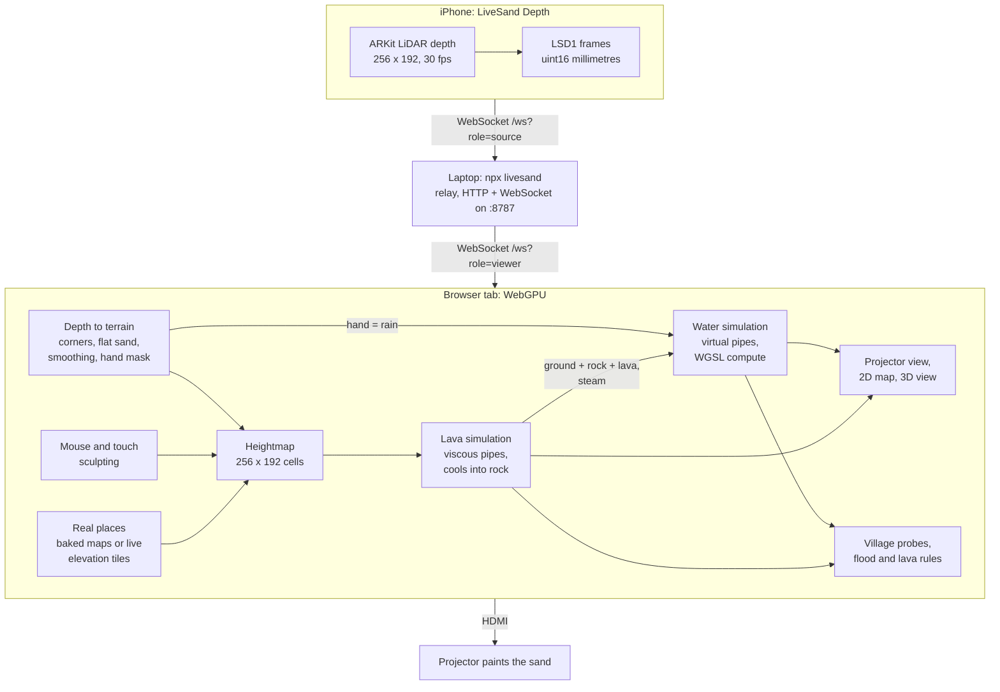

<p align="center">
  <a href="https://tranhuuhuy297.github.io/livesand/"></a>
</p>

<h1 align="center">LiveSand</h1>

<p align="center">
  <b>The $10,000 museum AR sandbox, rebuilt with an old iPhone, a $120 projector and a browser tab.</b>
</p>

<p align="center">
  <a href="https://github.com/tranhuuhuy297/livesand/actions/workflows/ci.yml"></a>
  <a href="LICENSE"></a>
  <a href="#browser-support"></a>
  <a href="https://tranhuuhuy297.github.io/livesand/"></a>
</p>

<p align="center">
  <a href="https://tranhuuhuy297.github.io/livesand/"><b>Play the live demo</b></a> ·
  <a href="#real-places">Real places</a> ·
  <a href="#volcano">Volcano</a> ·
  <a href="#build-the-real-sandbox">Build the real sandbox</a> ·
  <a href="#how-it-works">How it works</a> ·
  <a href="README.zh-CN.md">中文</a>
</p>

Dig a river with your mouse and real-time water follows it. Pile up a levee and the flood goes around. Wall off a
gully and the lava from an erupting volcano turns toward the sea. Load the real terrain of Hạ Long Bay, the Grand
Canyon or your own hometown and make it rain. Or pour real sand under a projector: an iPhone's LiDAR scans the sand 30
times a second, and the projector paints contour lines, rivers and lakes back onto it. Hold your hand over the box and
it rains.

Commercial AR sandboxes cost around $10,000 (the TopoBox Educator DIY kit lists at $9,890 plus $800 shipping at the
time of writing). LiveSand is free, MIT-licensed and runs in a browser tab.

## Try it in 10 seconds

1. Open **[tranhuuhuy297.github.io/livesand](https://tranhuuhuy297.github.io/livesand/)** in Chrome, Edge or Safari 26.
2. The lake next to Millbrook is rising. Press **2** (Dig) and drag from the village to the sea.
3. Keep the village dry until the clock runs out. Then try Twin Towns, Flash Flood, the volcano (Mount Ember) and
   Hội An Floods, or open the level menu and pick a **real place** or **Your hometown…**.

No install, no account, nothing to download. Your GPU runs the water simulation.

| **Volcano: a wall turns the lava into the sea** | **Mount Ember mid-eruption** |
| :---: | :---: |
|  |  |
| **Real place: Vịnh Hạ Long (Ha Long Bay)** | **Hội An Floods: a typhoon on the real Thu Bồn delta** |
|  |  |
| **2D map (Twin Towns)** | **3D view (Flash Flood, storm)** |
|  |  |
| **Projector mode: what lands on the sand** | **Calibration: click the four corners** |
|  |  |

## Features

- **Real-time shallow water on the GPU.** A virtual-pipes simulation in WebGPU compute shaders on a 256 × 192 grid:
  water flows downhill, fills lakes, spills over dams and drains into the sea.
- **Sculpt with mouse or touch.** Raise, Dig, Smooth, Flatten, Rain and Lava tools, in a 2D topographic map or a 3D
  orbit view.
- **Save the village.** Five hand-tuned levels (a rising lake, forked rivers, a flash-flood storm, a volcano, a typhoon
  on the real Hội An delta), stars, and a free play mode with springs, new landscapes and a rain toggle.
- **Real places.** Eight real landscapes ship with the app (Hạ Long Bay, Hội An, Huế, Fansipan, the Grand Canyon,
  Mount Fuji, Yosemite, Mount St. Helens), and any town on Earth loads from live elevation data. Flood your hometown,
  then share the link.
- **Lava.** A viscous lava simulation next to the water: it flows slowly, piles up, cools into rock that becomes new
  terrain, and hisses into steam where it meets water or the sea.
- **Real sand, real hands.** Projector mode turns iPhone LiDAR depth into terrain, and a hand held over the sand makes
  rain where it hovers.
- **Five-step calibration.** Corners, flat sand, relief range, projector keystone (CSS corner-pin), save. Stored in the
  browser; no config files.
- **One command for the hardware side.** `npx livesand` serves the app, relays the depth stream and shows a pairing QR
  code for the phone.
- **Small and dependency-light.** Raw WebGPU + WGSL, no game engine, no framework. Shareable URLs for every level and view.

## Real places

Open the level menu (the level name next to the logo) and scroll to **Real places**. Each map is real elevation data,
scaled to the sandbox: every hill, valley and coastline is where it is on Earth, and water runs down the real rivers.
The maps stay north-up.

| Place | Link | What to try |
| --- | --- | --- |
| Vịnh Hạ Long (Ha Long Bay), Vietnam | [`?place=ha-long-bay`](https://tranhuuhuy297.github.io/livesand/?place=ha-long-bay) | Nearly two thousand limestone karst towers in a shallow bay |
| Hội An, Vietnam | [`?place=hoi-an`](https://tranhuuhuy297.github.io/livesand/?place=hoi-an) | The Thu Bồn delta; its challenge level is **Hội An Floods** |
| Huế, Vietnam | [`?place=hue`](https://tranhuuhuy297.github.io/livesand/?place=hue) | The Perfume River winding from the hills to the Tam Giang lagoon |
| Phan Xi Păng (Fansipan), Vietnam | [`?place=fansipan`](https://tranhuuhuy297.github.io/livesand/?place=fansipan) | The roof of Indochina: steep valleys turn heavy rain into flash floods |
| Grand Canyon, USA | [`?place=grand-canyon`](https://tranhuuhuy297.github.io/livesand/?place=grand-canyon) | A canyon up to 1.8 km deep; its side canyons light up with water |
| Mount Fuji, Japan | [`?place=mount-fuji`](https://tranhuuhuy297.github.io/livesand/?place=mount-fuji) | Pour lava on the cone above the Fuji Five Lakes |
| Yosemite Valley, USA | [`?place=yosemite`](https://tranhuuhuy297.github.io/livesand/?place=yosemite) | El Capitan, Half Dome and the Merced River |
| Mount St. Helens, USA | [`?place=mount-st-helens`](https://tranhuuhuy297.github.io/livesand/?place=mount-st-helens) | The 1980 horseshoe crater opening toward Spirit Lake |

When a map opens, a card describes the place and offers **Flood it**, **Make it rain**, **Pour lava** and, on Hội An,
**Play Hội An Floods**. Every tool works on real terrain: dig a new channel for the Perfume River, or wall off a valley
and watch it fill.

### Flood your hometown

1. Level menu → **Your hometown…**
2. Tap **Use my location**, or search for a town by name, or type coordinates such as `16.05, 108.21`. The slider sets
   how much land the map covers (2–100 km across; a searched town suggests its own size).
3. The terrain downloads in a few seconds. Press **Flood it**: a typhoon breaks over the map and your town sits on low,
   flat ground near the middle. Raise its ground, dig drains or build levees to keep it dry for 60 seconds.
4. **Share** opens the system share sheet where the browser has one (phones), otherwise it copies the link, so
   friends open the same map.

Links name a catalogue place or any point on Earth:

| URL | Opens |
| --- | --- |
| `?place=ha-long-bay` | A built-in place (ids in the table above) |
| `?place=16.0544,108.2022` | Live terrain 20 km across, centred on that latitude, longitude |
| `?place=16.0544,108.2022,12&name=Da%20Nang` | 12 km across (2–100), with a name for the title and the share text |

Built-in places ship with the app. Other places need the internet: elevation comes from the
[AWS Terrain Tiles](https://registry.opendata.aws/terrain-tiles/) and town search from
[Photon](https://photon.komoot.io/) (OpenStreetMap data). Latitudes beyond 80° are not supported.

## Volcano

**Mount Ember** (level 4) is waking up. The crater fills with lava, overflows and sends it down a gully into the village
of Emberton; a village under molten lava for 3 seconds burns down, and its chip warns **Lava close** before that. Build
a wall across the gully along the dashed line, just below the fork, and the lava takes the old channel into the sea,
where it cools into new land. Two smaller waves follow, so the wall has to hold.

Press **6** for the **Lava** tool to pour lava yourself, in free play, on real places and on volcano levels. Lava
flows slowly, piles up and stalls on gentle slopes, cools into dark rock that becomes new ground, and boils water into
steam. Pour it down Mount Fuji, into Spirit Lake at Mount St. Helens, or across a river to dam it and watch a lake rise
behind the rock. In 3D the sky darkens with ash while Mount Ember erupts.

Lava runs in virtual mode; projector mode swaps Mount Ember for blank sand.

## Build the real sandbox

<p align="center"></p>

| Part | What to get | Rough price (USD) |
| --- | --- | --- |
| Depth camera | A LiDAR iPhone or iPad: iPhone 12 Pro or any newer Pro, iPad Pro 2020 or newer | $0 if you own one, about $200–300 used |
| Projector | Any HDMI projector, 720p or better. Brighter is better; short-throw helps under low ceilings | about $120 |
| Computer | Any laptop with Chrome or Edge, on the same Wi-Fi as the phone | the one you have |
| Box | About 100 × 75 cm and 15–20 cm deep: an under-bed storage box, or four planks on a board | $20–40 |
| Sand | 90–110 kg of fine, light-coloured play sand (8–10 cm deep); light sand shows the projection best | $25–50 |
| Mounts | A phone holder on a boom arm or tripod, and a shelf, tripod or ceiling bracket for the projector | $30–60 |

Without the phone and the laptop, that is roughly **$200–300**.

1. **Mount the hardware.** Projector and phone 1–1.5 m above the sand, both looking straight down at the box. The
   [hardware setup guide](docs/hardware-setup-guide.md) covers throw distance, mounting and sand.
2. **Start the relay** on the laptop: `npx livesand` (Node 20 or newer). It prints the URLs below.
   If `npx` cannot find the package yet, run it from a clone: `npm ci && npm run build && npm start`.
3. **Open projector mode** on the machine driving the projector (usually the same laptop):
   `http://<laptop-ip>:8787/?mode=projector`. Drag the window onto the projector and press **F** for fullscreen.
4. **Install the iPhone app.** LiveSand Depth is not on the App Store yet: build it with Xcode and XcodeGen (a free
   Apple ID is enough). Step-by-step: [ios/README.md](ios/README.md).
5. **Pair.** Tap *Scan pairing QR code* in the app, point it at the QR code in the projector page's *Connect iPhone*
   panel, then tap *Start streaming*.
6. **Calibrate.** The wizard opens as soon as depth arrives: click the four sandbox corners, capture the flat sand, set
   the relief range, drag the projected grid onto the box, save. Then dig, pile, and hold your hand over the sand.

No phone yet? `npx livesand fake-source` streams synthetic depth frames so you can try projector mode and the wizard.

## Controls

| Action | Mouse / trackpad | Touch | Keyboard |
| --- | --- | --- | --- |
| Use the active tool | Left drag | One finger | |
| Pick a tool | Tool dock | Tool dock | **1** Raise · **2** Dig · **3** Smooth · **4** Flatten · **5** Rain · **6** Lava |
| Brush size | Slider, Alt + wheel (wheel in 2D) | Slider | **[** and **]** |
| Orbit the camera (3D) | Right drag, or Space + drag | Two fingers | |
| Zoom (3D) | Wheel | Pinch | |
| 2D map / 3D view | Toolbar | Toolbar | **V** |
| Start / restart the level | Start button | Start button | **Enter** / **R** |
| Pick a level or a real place | Level menu | Level menu | |
| Simulation speed 1× / 2× / 4× | Toolbar | Toolbar | |
| Help / fullscreen | Toolbar | Toolbar | **H** / **F** |

The Lava tool (**6**) appears in free play, on real places and on volcano levels.

Projector mode: **H** hides the status panel, **C** re-runs calibration, **F** toggles fullscreen, **Enter** starts a
level and **R** restarts it.

URL parameters make every setup shareable:

| Parameter | Values |
| --- | --- |
| `level` | `first-flood`, `twin-towns`, `flash-flood`, `mount-ember`, `hoi-an-floods`, `sandbox` (free play), `blank` (flat empty box) |
| `place` | A real place: `ha-long-bay`, `hoi-an`, `hue`, `fansipan`, `grand-canyon`, `mount-fuji`, `yosemite`, `mount-st-helens`, or `lat,lon[,widthKm]` (see [Real places](#real-places)) |
| `name` | A label for `place` coordinates, e.g. `name=Da%20Nang` |
| `view` | `2d`, `3d` |
| `mode` | `projector` for the real sandbox |
| `relay` | Relay address for projector mode, e.g. `192.168.1.20:8787` |
| `debug` | `1` shows frame rate and simulation steps |

## How it works



**Water: virtual pipes.** Every cell stores its terrain height, its water depth and the flow through four virtual pipes
to its neighbours ([Mei et al. 2007](#credits)). Each 50 ms step runs two compute passes: the first accelerates the
flow in each pipe by gravity times the difference in water-surface height (with a little damping) and scales it down
so no cell ships out more water than it holds; the second adds inflow, removes outflow, adds rain and springs, and
evaporates 1 % per second. Open edges drain like a coastline. Both renderers read the simulation's GPU buffers
directly, so nothing is copied back to the CPU except a few village depth probes, read asynchronously.

**Lava: slow pipes.** Lava is a second virtual-pipes simulation with its own depth and flow. The flow is damped hard
and must beat a yield stress that grows as the lava thins, so it creeps, piles into lobes and stalls instead of
running like water. Each step a little lava turns into rock, much faster where it touches water or the sea, and water
next to lava boils away. The water simulation then sees the ground as terrain + rock + lava, so rivers flow around a
lava flow and a cooled flow becomes new land. Villages burn after a few seconds under molten lava.

**Real places: elevation to sand.** Built-in places are baked into small files (96 KB each, `public/places/`) by
`npm run bake:places`; any other place downloads the [AWS Terrain Tiles](https://registry.opendata.aws/terrain-tiles/)
around it and resamples them to the grid in the browser. Heights are scaled so the land spans about the same relief as
the made-up levels (flat deltas such as Hội An and Huế use a fixed 9×). Sea level becomes a painted sea with open
edges where the coast meets the frame; basins below sea level, such as Death Valley or the Dead Sea, stay land. DEM
noise is smoothed, shallow hollows are filled so rain runs off, and 15 seconds of rain are routed into the rivers
before the first frame, so the drainage network and lakes are already full.

**Sand: depth to terrain.** The four clicked corners define a homography from the LiDAR image to the simulation grid.
Each cell's height is the flat-sand reference depth minus the measured depth, scaled so the box width spans 256 cells.
Anything more than 5 cm above the pile limit you set in calibration is a hand: those cells rain and keep their last
sand height. A per-cell moving average, a small change threshold and a light Gaussian blur keep the contours steady
while you dig.
The projector image is corner-pinned onto the box with a CSS `matrix3d` transform.

More detail: [system architecture](docs/system-architecture.md) and the [LSD1 depth protocol](docs/depth-protocol.md).

## Browser support

LiveSand needs [WebGPU](https://caniuse.com/webgpu). Support depends on the browser, OS, GPU and drivers, and it is
still spreading, so treat this as a guide:

| Browser | Status |
| --- | --- |
| Chrome / Edge 113+ | Windows, macOS and ChromeOS. Recommended. Android needs Chrome 121+ on a recent device |
| Chrome on Linux | Often behind a flag: enable `chrome://flags/#enable-unsafe-webgpu` (and Vulkan) |
| Safari 26 | macOS, iOS and iPadOS 26 |
| Firefox 141+ | Windows; other platforms are rolling out |

If WebGPU is missing, LiveSand shows a page explaining what to try instead of a blank screen.

## FAQ

**Can I use a Kinect instead of an iPhone?**
Not yet. The classic AR sandbox uses a Kinect, and LiveSand's depth input is a tiny WebSocket protocol
([LSD1](docs/depth-protocol.md): a 28-byte header plus 16-bit millimetres), so a Kinect bridge is a small program.
It is on the roadmap, and a great first contribution.

**Orbbec or Intel RealSense?**
Same answer: any depth camera works once a bridge sends LSD1 frames to the relay. Both are on the roadmap.

**Android?**
Very few Android phones have a real depth sensor, and depth estimated from the camera is too coarse for centimetre-high
sand. Virtual mode works on Android in Chrome.

**I have no LiDAR phone. Can I still play?**
Yes: virtual mode needs nothing but a WebGPU browser. To try projector mode and the calibration wizard without a phone,
run `npx livesand fake-source`.

**Why do I need `npx livesand`? Isn't it a web app?**
It is, but a page served over HTTPS (like the GitHub Pages demo) cannot open a plain `ws://` connection to a phone on
your network. The relay serves the app on your LAN, forwards the depth stream and shows the pairing QR code. Nothing
leaves your network, and only depth values are sent, never camera images.

**Does it need the internet?**
Not for the real sandbox: once installed, the relay, the phone and the browser only talk to each other on your local
network. The levels and the eight built-in places ship with the app; only **Your hometown…** and other
`?place=lat,lon` maps go online, to download elevation tiles and search place names.

**Is my location sent anywhere?**
Only if you press **Use my location**. The browser asks first; the coordinates then go to Photon to name the map and to
the AWS Terrain Tiles as tile requests, and they end up in the page link. A shared link therefore shows where the map
is centred, so search for a town instead if you would rather not share your exact spot.

## Roadmap

- [x] Lava and a volcano level (0.2)
- [x] Real places: built-in landscapes, any town on Earth, "Flood it" storms and shareable map links (0.2)
- [ ] Erosion: water that moves sand (the virtual-pipes paper models it)
- [ ] Lava on real sand in projector mode
- [ ] Depth camera bridges: Orbbec, Intel RealSense, Kinect
- [ ] Lesson plans: watersheds, contour maps, flood planning, volcanoes
- [ ] TestFlight / App Store build of LiveSand Depth
- [ ] More levels, more real-place challenges, and a level editor

Ideas and pull requests are welcome: see [CONTRIBUTING.md](CONTRIBUTING.md) and the [project roadmap](docs/project-roadmap.md).

## Development

```bash
git clone https://github.com/tranhuuhuy297/livesand && cd livesand
npm ci
npm run dev                       # http://localhost:5173 (virtual mode)
npm run typecheck && npm test     # TypeScript + unit tests (Vitest)
npm run test:e2e                  # Playwright, headless Chromium with WebGPU on SwiftShader
npm run build && npm start        # the relay + built app on :8787, like npx livesand
npm run demo:media                # re-record the GIFs and screenshots in docs/assets/ (-- --only volcano,places)
npm run bake:places               # re-bake the built-in real places into public/places/ from elevation tiles
```

Docs: [project overview](docs/project-overview-pdr.md) · [codebase summary](docs/codebase-summary.md) ·
[code standards](docs/code-standards.md) · [deployment](docs/deployment-guide.md) · [changelog](docs/project-changelog.md)

## Credits

- The [UC Davis Augmented Reality Sandbox](https://web.cs.ucdavis.edu/~okreylos/ResDev/SARndbox/) by Oliver Kreylos
  (UC Davis KeckCAVES) started it all, and inspired this project.
- The water model follows Xing Mei, Philippe Decaudin and Bao-Gang Hu, *Fast Hydraulic Erosion Simulation and
  Visualization on GPU*, Pacific Graphics 2007.
- Built on [wgpu-matrix](https://github.com/greggman/wgpu-matrix), [qrcode](https://github.com/soldair/node-qrcode) and
  [ws](https://github.com/websockets/ws).
- Place search by [Photon](https://photon.komoot.io/) from komoot, with data ©
  [OpenStreetMap](https://www.openstreetmap.org/copyright) contributors.

### Terrain data

Real places use the [Terrain Tiles](https://registry.opendata.aws/terrain-tiles/) by Mapzen via the AWS Registry of
Open Data ([attribution](https://github.com/tilezen/joerd/blob/master/docs/attribution.md)). The app shows the credit for
each map in its bottom corner. The built-in places use:

- Hạ Long Bay, Hội An, Huế, Fansipan: global GMTED2010 and SRTM terrain data courtesy of the U.S. Geological Survey.
- Mount Fuji: the same, plus: Global ETOPO1 terrain data U.S. National Oceanic and Atmospheric Administration.
- Grand Canyon, Yosemite Valley, Mount St. Helens: United States 3DEP (formerly NED) terrain data courtesy of the U.S.
  Geological Survey.

<details>
<summary>Full terrain attribution (maps loaded live for other places may use any of these sources)</summary>

- Terrain Tiles by Mapzen via the AWS Registry of Open Data.
- ArcticDEM terrain data DEM(s) were created from DigitalGlobe, Inc., imagery and funded under National Science Foundation awards 1043681, 1559691, and 1542736.
- Australia terrain data © Commonwealth of Australia (Geoscience Australia) 2017.
- Austria terrain data © offene Daten Österreichs – Digitales Geländemodell (DGM) Österreich.
- Canada terrain data contains information licensed under the Open Government Licence – Canada.
- Europe terrain data produced using Copernicus data and information funded by the European Union - EU-DEM layers.
- Global ETOPO1 terrain data U.S. National Oceanic and Atmospheric Administration.
- Mexico terrain data source: INEGI, Continental relief, 2016.
- New Zealand terrain data Copyright 2011 Crown copyright (c) Land Information New Zealand and the New Zealand Government (All rights reserved).
- Norway terrain data © Kartverket.
- United Kingdom terrain data © Environment Agency copyright and/or database right 2015. All rights reserved.
- United States 3DEP (formerly NED) and global GMTED2010 and SRTM terrain data courtesy of the U.S. Geological Survey.

</details>

## License

[MIT](LICENSE) © LiveSand contributors.

If LiveSand made you smile, a star helps other teachers, museums and makers find it.
