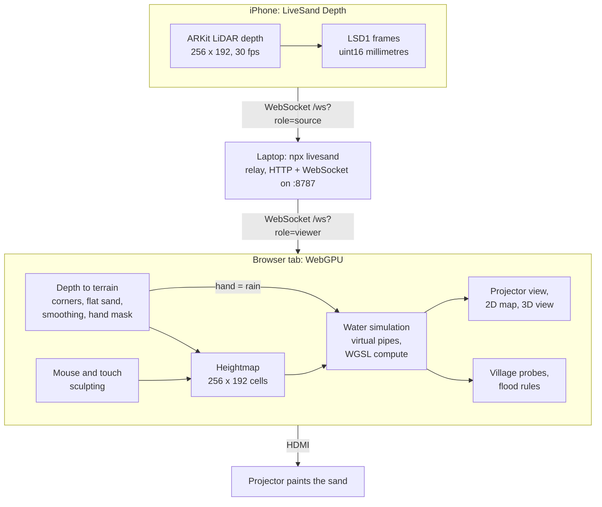

<p align="center">
  <a href="https://tranhuuhuy297.github.io/livesand/"></a>
</p>

<h1 align="center">LiveSand</h1>

<p align="center">
  <b>The $10,000 museum AR sandbox, rebuilt with an old iPhone, a $120 projector and a browser tab.</b>
</p>

<p align="center">
  <a href="https://github.com/tranhuuhuy297/livesand/actions/workflows/ci.yml"></a>
  <a href="LICENSE"></a>
  <a href="#browser-support"></a>
  <a href="https://tranhuuhuy297.github.io/livesand/"></a>
</p>

<p align="center">
  <a href="https://tranhuuhuy297.github.io/livesand/"><b>Play the live demo</b></a> ·
  <a href="#build-the-real-sandbox">Build the real sandbox</a> ·
  <a href="#how-it-works">How it works</a> ·
  <a href="README.zh-CN.md">中文</a>
</p>

Dig a river with your mouse and real-time water follows it. Pile up a levee and the flood goes around. Or pour real sand
under a projector: an iPhone's LiDAR scans the sand 30 times a second, and the projector paints contour lines, rivers
and lakes back onto it. Hold your hand over the box and it rains.

Commercial AR sandboxes cost around $10,000 (the TopoBox Educator DIY kit lists at $9,890 plus $800 shipping at the
time of writing). LiveSand is free, MIT-licensed and runs in a browser tab.

## Try it in 10 seconds

1. Open **[tranhuuhuy297.github.io/livesand](https://tranhuuhuy297.github.io/livesand/)** in Chrome, Edge or Safari 26.
2. The lake next to Millbrook is rising. Press **2** (Dig) and drag from the village to the sea.
3. Keep the village dry until the clock runs out. Then try Twin Towns and Flash Flood, or free play.

No install, no account, nothing to download. Your GPU runs the water simulation.

| 2D map (Twin Towns) | 3D view (Flash Flood, storm) |
| :---: | :---: |
|  |  |
| **Projector mode: what lands on the sand** | **Calibration: click the four corners** |
|  |  |

## Features

- **Real-time shallow water on the GPU.** A virtual-pipes simulation in WebGPU compute shaders on a 256 × 192 grid:
  water flows downhill, fills lakes, spills over dams and drains into the sea.
- **Sculpt with mouse or touch.** Raise, Dig, Smooth, Flatten and Rain tools, in a 2D topographic map or a 3D orbit view.
- **Save the village.** Three hand-tuned levels (a rising lake, forked rivers, a flash-flood storm), stars, and a free
  play mode with springs, new landscapes and a rain toggle.
- **Real sand, real hands.** Projector mode turns iPhone LiDAR depth into terrain, and a hand held over the sand makes
  rain where it hovers.
- **Five-step calibration.** Corners, flat sand, relief range, projector keystone (CSS corner-pin), save. Stored in the
  browser; no config files.
- **One command for the hardware side.** `npx livesand` serves the app, relays the depth stream and shows a pairing QR
  code for the phone.
- **Small and dependency-light.** Raw WebGPU + WGSL, no game engine, no framework. Shareable URLs for every level and view.

## Build the real sandbox

<p align="center"></p>

| Part | What to get | Rough price (USD) |
| --- | --- | --- |
| Depth camera | A LiDAR iPhone or iPad: iPhone 12 Pro or any newer Pro, iPad Pro 2020 or newer | $0 if you own one, about $200–300 used |
| Projector | Any HDMI projector, 720p or better. Brighter is better; short-throw helps under low ceilings | about $120 |
| Computer | Any laptop with Chrome or Edge, on the same Wi-Fi as the phone | the one you have |
| Box | About 100 × 75 cm and 15–20 cm deep: an under-bed storage box, or four planks on a board | $20–40 |
| Sand | 90–110 kg of fine, light-coloured play sand (8–10 cm deep); light sand shows the projection best | $25–50 |
| Mounts | A phone holder on a boom arm or tripod, and a shelf, tripod or ceiling bracket for the projector | $30–60 |

Without the phone and the laptop, that is roughly **$200–300**.

1. **Mount the hardware.** Projector and phone 1–1.5 m above the sand, both looking straight down at the box. The
   [hardware setup guide](docs/hardware-setup-guide.md) covers throw distance, mounting and sand.
2. **Start the relay** on the laptop: `npx livesand` (Node 20 or newer). It prints the URLs below.
   If `npx` cannot find the package yet, run it from a clone: `npm ci && npm run build && npm start`.
3. **Open projector mode** on the machine driving the projector (usually the same laptop):
   `http://<laptop-ip>:8787/?mode=projector`. Drag the window onto the projector and press **F** for fullscreen.
4. **Install the iPhone app.** LiveSand Depth is not on the App Store yet: build it with Xcode and XcodeGen (a free
   Apple ID is enough). Step-by-step: [ios/README.md](ios/README.md).
5. **Pair.** Tap *Scan pairing QR code* in the app, point it at the QR code in the projector page's *Connect iPhone*
   panel, then tap *Start streaming*.
6. **Calibrate.** The wizard opens as soon as depth arrives: click the four sandbox corners, capture the flat sand, set
   the relief range, drag the projected grid onto the box, save. Then dig, pile, and hold your hand over the sand.

No phone yet? `npx livesand fake-source` streams synthetic depth frames so you can try projector mode and the wizard.

## Controls

| Action | Mouse / trackpad | Touch | Keyboard |
| --- | --- | --- | --- |
| Use the active tool | Left drag | One finger | |
| Pick a tool | Tool dock | Tool dock | **1** Raise · **2** Dig · **3** Smooth · **4** Flatten · **5** Rain |
| Brush size | Slider, Alt + wheel (wheel in 2D) | Slider | **[** and **]** |
| Orbit the camera (3D) | Right drag, or Space + drag | Two fingers | |
| Zoom (3D) | Wheel | Pinch | |
| 2D map / 3D view | Toolbar | Toolbar | **V** |
| Start / restart the level | Start button | Start button | **Enter** / **R** |
| Simulation speed 1× / 2× / 4× | Toolbar | Toolbar | |
| Help / fullscreen | Toolbar | Toolbar | **H** / **F** |

Projector mode: **H** hides the status panel, **C** re-runs calibration, **F** toggles fullscreen, **Enter** starts a
level and **R** restarts it.

URL parameters make every setup shareable:

| Parameter | Values |
| --- | --- |
| `level` | `first-flood`, `twin-towns`, `flash-flood`, `sandbox` (free play), `blank` (flat empty box) |
| `view` | `2d`, `3d` |
| `mode` | `projector` for the real sandbox |
| `relay` | Relay address for projector mode, e.g. `192.168.1.20:8787` |
| `debug` | `1` shows frame rate and simulation steps |

## How it works



**Water: virtual pipes.** Every cell stores its terrain height, its water depth and the flow through four virtual pipes
to its neighbours ([Mei et al. 2007](#credits)). Each 50 ms step runs two compute passes: the first accelerates the
flow in each pipe by gravity times the difference in water-surface height (with a little damping) and scales it down
so no cell ships out more water than it holds; the second adds inflow, removes outflow, adds rain and springs, and
evaporates 1 % per second. Open edges drain like a coastline. Both renderers read the simulation's GPU buffers
directly, so nothing is copied back to the CPU except a few village depth probes, read asynchronously.

**Sand: depth to terrain.** The four clicked corners define a homography from the LiDAR image to the simulation grid.
Each cell's height is the flat-sand reference depth minus the measured depth, scaled so the box width spans 256 cells.
Anything more than 5 cm above the pile limit you set in calibration is a hand: those cells rain and keep their last
sand height. A per-cell moving average, a small change threshold and a light Gaussian blur keep the contours steady
while you dig.
The projector image is corner-pinned onto the box with a CSS `matrix3d` transform.

More detail: [system architecture](docs/system-architecture.md) and the [LSD1 depth protocol](docs/depth-protocol.md).

## Browser support

LiveSand needs [WebGPU](https://caniuse.com/webgpu). Support depends on the browser, OS, GPU and drivers, and it is
still spreading, so treat this as a guide:

| Browser | Status |
| --- | --- |
| Chrome / Edge 113+ | Windows, macOS and ChromeOS. Recommended. Android needs Chrome 121+ on a recent device |
| Chrome on Linux | Often behind a flag: enable `chrome://flags/#enable-unsafe-webgpu` (and Vulkan) |
| Safari 26 | macOS, iOS and iPadOS 26 |
| Firefox 141+ | Windows; other platforms are rolling out |

If WebGPU is missing, LiveSand shows a page explaining what to try instead of a blank screen.

## FAQ

**Can I use a Kinect instead of an iPhone?**
Not yet. The classic AR sandbox uses a Kinect, and LiveSand's depth input is a tiny WebSocket protocol
([LSD1](docs/depth-protocol.md): a 28-byte header plus 16-bit millimetres), so a Kinect bridge is a small program.
It is on the roadmap, and a great first contribution.

**Orbbec or Intel RealSense?**
Same answer: any depth camera works once a bridge sends LSD1 frames to the relay. Both are on the roadmap.

**Android?**
Very few Android phones have a real depth sensor, and depth estimated from the camera is too coarse for centimetre-high
sand. Virtual mode works on Android in Chrome.

**I have no LiDAR phone. Can I still play?**
Yes: virtual mode needs nothing but a WebGPU browser. To try projector mode and the calibration wizard without a phone,
run `npx livesand fake-source`.

**Why do I need `npx livesand`? Isn't it a web app?**
It is, but a page served over HTTPS (like the GitHub Pages demo) cannot open a plain `ws://` connection to a phone on
your network. The relay serves the app on your LAN, forwards the depth stream and shows the pairing QR code. Nothing
leaves your network, and only depth values are sent, never camera images.

**Does it need the internet?**
No. Once installed, the relay, the phone and the browser only talk to each other on your local network.

## Roadmap

- [ ] Erosion: water that moves sand (the virtual-pipes paper models it)
- [ ] Lava mode and other fluids
- [ ] Depth camera bridges: Orbbec, Intel RealSense, Kinect
- [ ] Lesson plans: watersheds, contour maps, flood planning
- [ ] TestFlight / App Store build of LiveSand Depth
- [ ] More levels and a level editor

Ideas and pull requests are welcome: see [CONTRIBUTING.md](CONTRIBUTING.md) and the [project roadmap](docs/project-roadmap.md).

## Development

```bash
git clone https://github.com/tranhuuhuy297/livesand && cd livesand
npm ci
npm run dev                       # http://localhost:5173 (virtual mode)
npm run typecheck && npm test     # TypeScript + unit tests (Vitest)
npm run test:e2e                  # Playwright, headless Chromium with WebGPU on SwiftShader
npm run build && npm start        # the relay + built app on :8787, like npx livesand
npm run demo:media                # re-record the GIF and screenshots in docs/assets/
```

Docs: [project overview](docs/project-overview-pdr.md) · [codebase summary](docs/codebase-summary.md) ·
[code standards](docs/code-standards.md) · [deployment](docs/deployment-guide.md) · [changelog](docs/project-changelog.md)

## Credits

- The [UC Davis Augmented Reality Sandbox](https://web.cs.ucdavis.edu/~okreylos/ResDev/SARndbox/) by Oliver Kreylos
  (UC Davis KeckCAVES) started it all, and inspired this project.
- The water model follows Xing Mei, Philippe Decaudin and Bao-Gang Hu, *Fast Hydraulic Erosion Simulation and
  Visualization on GPU*, Pacific Graphics 2007.
- Built on [wgpu-matrix](https://github.com/greggman/wgpu-matrix), [qrcode](https://github.com/soldair/node-qrcode) and
  [ws](https://github.com/websockets/ws).

## License

[MIT](LICENSE) © LiveSand contributors.

If LiveSand made you smile, a star helps other teachers, museums and makers find it.
