<p align="center">
  <a href="https://tranhuuhuy297.github.io/livesand/">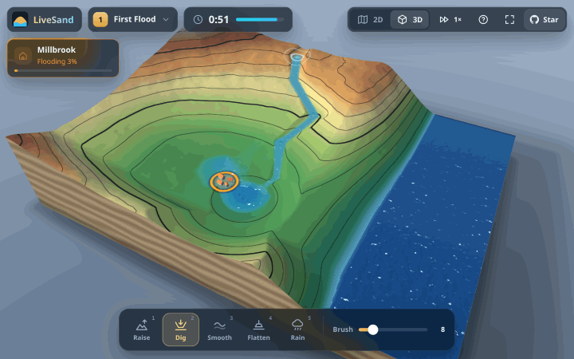</a>
</p>

<h1 align="center">LiveSand</h1>

<p align="center">
  <b>博物馆里一万美元的 AR 沙盘，用一台旧 iPhone、一台 120 美元的投影仪和一个浏览器标签页重新做出来。</b>
</p>

<p align="center">
  <a href="https://github.com/tranhuuhuy297/livesand/actions/workflows/ci.yml"></a>
  <a href="LICENSE"></a>
  <a href="#浏览器支持"></a>
  <a href="https://tranhuuhuy297.github.io/livesand/"></a>
</p>

<p align="center">
  <a href="https://tranhuuhuy297.github.io/livesand/"><b>在线试玩</b></a> ·
  <a href="#真实地点">真实地点</a> ·
  <a href="#火山">火山</a> ·
  <a href="#搭建真实沙盘">搭建真实沙盘</a> ·
  <a href="#工作原理">工作原理</a> ·
  <a href="README.md">English</a>
</p>

用鼠标挖一条河，实时模拟的水就会顺着它流走；堆起一道堤坝，洪水就会绕道而行；在山沟上筑一道墙，火山喷出的岩浆就会
转向流入大海。载入下龙湾、科罗拉多大峡谷或者你家乡的真实地形，再让它下一场雨。你也可以把真沙子放到投影仪下面：
iPhone 的激光雷达（LiDAR）每秒扫描沙面 30 次，投影仪再把等高线、河流和湖泊画回沙子上。把手悬在沙箱上方，那里就会下雨。

商用 AR 沙盘动辄一万美元左右（撰写本文时，TopoBox Educator DIY 套件标价 9,890 美元，另加 800 美元运费）。
LiveSand 免费、采用 MIT 许可证，在浏览器里就能运行。

## 10 秒上手

1. 用 Chrome、Edge 或 Safari 26 打开 **[tranhuuhuy297.github.io/livesand](https://tranhuuhuy297.github.io/livesand/)**。
2. Millbrook 村旁边的湖水正在上涨。按 **2**（Dig，挖掘），从村子一直拖到海边。
3. 坚持到倒计时结束，别让村子被淹。然后试试 Twin Towns（双子镇）、Flash Flood（山洪暴发）、火山关卡 Mount Ember
   （余烬山）和 Hội An Floods（会安洪水），或者打开关卡菜单，选一个**真实地点**或 **Your hometown…**（你的家乡）。

无需安装、无需注册、不用下载任何东西，水流模拟直接跑在你的 GPU 上。

| **火山：一道墙把岩浆引向大海** | **喷发中的 Mount Ember** |
| :---: | :---: |
| 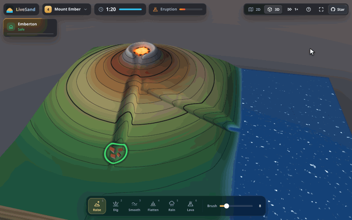 | 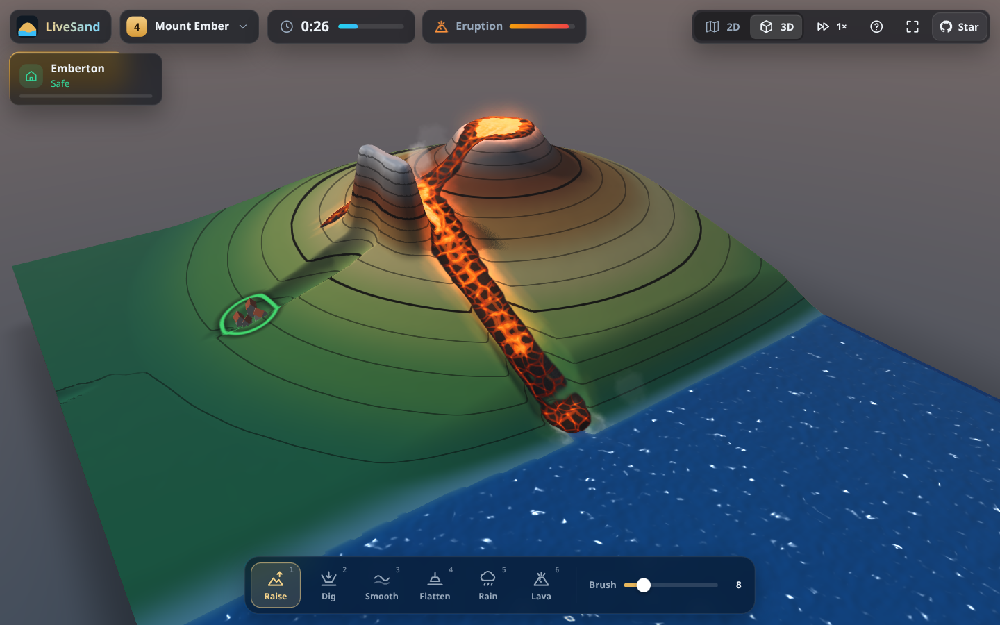 |
| **真实地点：下龙湾（Vịnh Hạ Long）** | **Hội An Floods：台风袭击真实的秋盆河三角洲** |
| 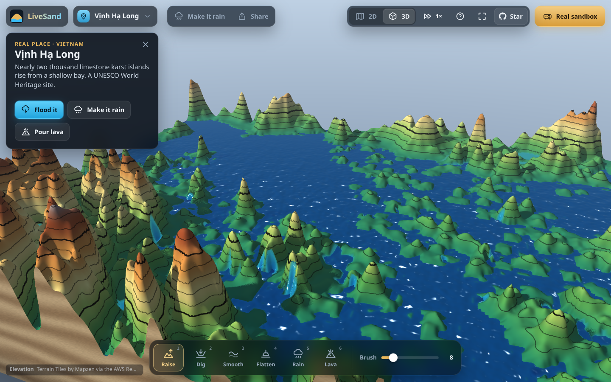 | 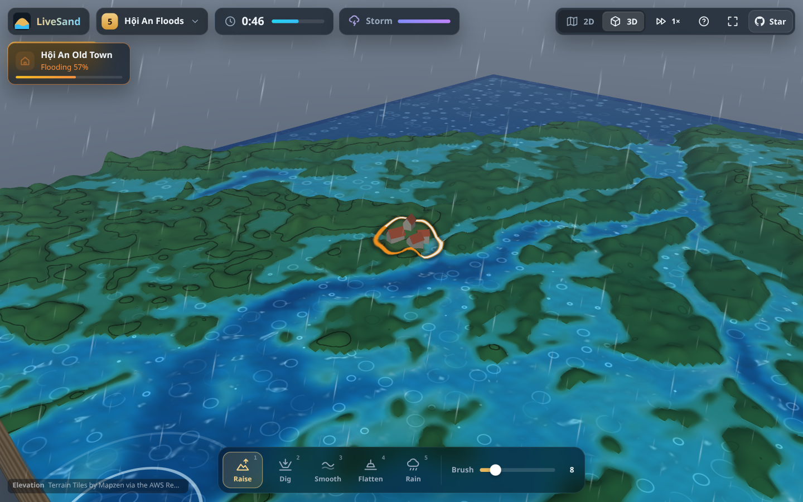 |
| **2D 地图（Twin Towns）** | **3D 视图（Flash Flood，暴风雨中）** |
| 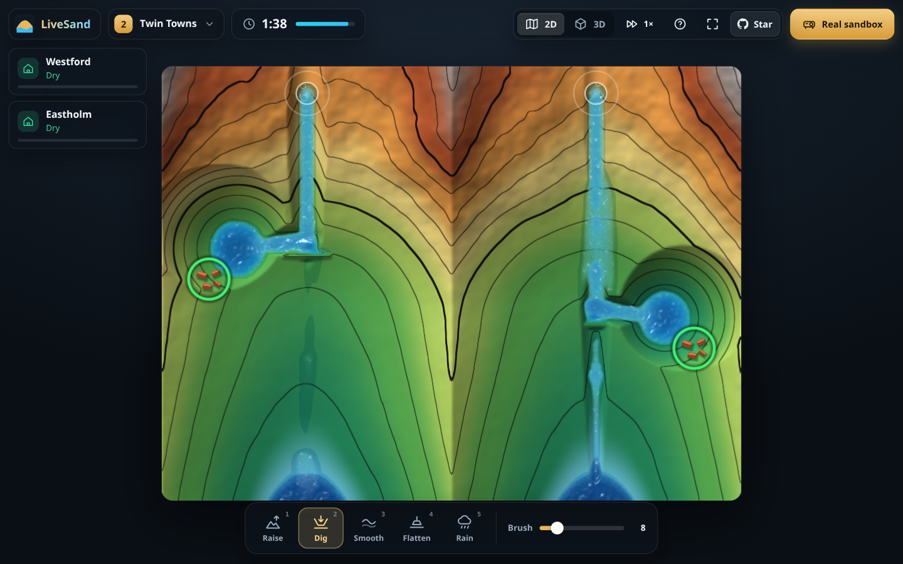 | 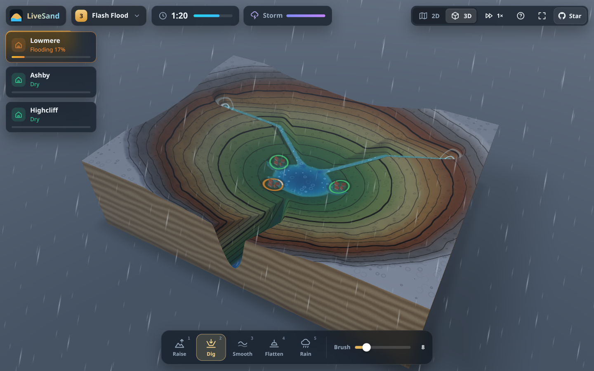 |
| **投影模式：投到沙子上的画面** | **标定：点出沙箱的四个角** |
| 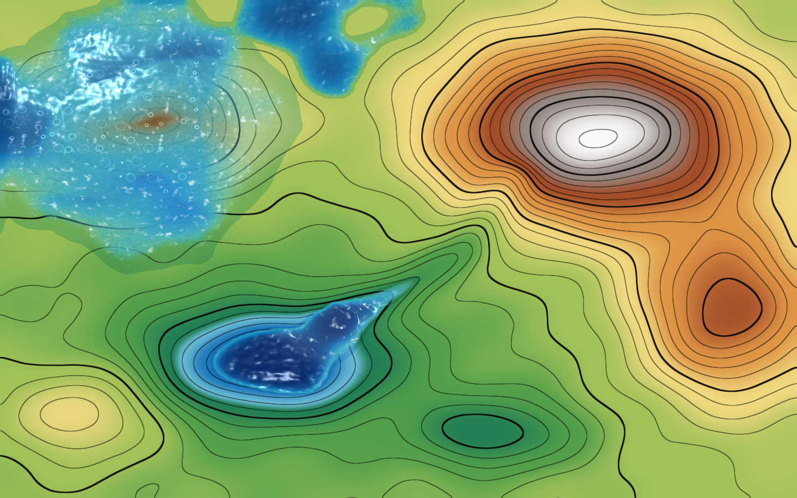 | 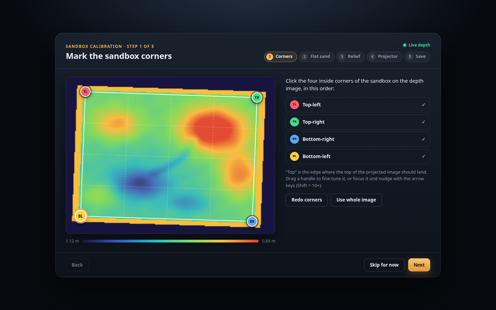 |

## 功能特性

- **GPU 实时浅水模拟。** 基于“虚拟管道”模型，用 WebGPU 计算着色器在 256 × 192 的网格上求解：
  水往低处流，灌满湖泊，漫过堤坝，最后流入大海。
- **鼠标或触屏塑形。** 抬升、挖掘、平滑、整平、降雨和岩浆六种工具，可在 2D 地形图和可环绕的 3D 视图之间切换。
- **拯救村庄。** 五个精心调校的关卡（上涨的湖水、分叉的河道、暴雨引发的山洪、一座火山，以及真实会安三角洲上的台风），
  带星级评价；还有自由模式，自带泉眼、可随机生成新地形，也能一键下雨。
- **真实地点。** 内置八处真实地形（下龙湾、会安、顺化、番西邦峰、科罗拉多大峡谷、富士山、优胜美地山谷、圣海伦火山），
  地球上任何城镇都能用在线高程数据载入。淹一淹你的家乡，再把链接分享出去。
- **岩浆。** 与水流并行的黏稠岩浆模拟：流得很慢、会堆积，冷却后变成岩石、成为新的地形，碰到水或大海时化作蒸汽。
- **真沙子，真的手。** 投影模式把 iPhone LiDAR 的深度数据变成地形，手悬在沙子上方，哪里就下雨。
- **五步标定。** 角点、平整沙面、起伏范围、投影梯形校正（CSS 四角映射）、保存。数据存在浏览器里，不需要任何配置文件。
- **硬件端只需一条命令。** `npx livesand` 同时提供网页、转发深度数据流，并显示供手机扫描的配对二维码。
- **小巧，依赖少。** 纯 WebGPU + WGSL，不用游戏引擎，也不用前端框架。每个关卡和视角都有可分享的链接。

## 真实地点

打开关卡菜单（Logo 旁边的关卡名），往下找到 **Real places**（真实地点）。每张地图都是真实的高程数据，按比例缩放到沙盘里：
每座山、每条山谷和每段海岸线都在它在地球上的位置，水也顺着真实的河道流。这些地图始终上北下南。

| 地点 | 链接 | 可以试试 |
| --- | --- | --- |
| 下龙湾（Vịnh Hạ Long），越南 | [`?place=ha-long-bay`](https://tranhuuhuy297.github.io/livesand/?place=ha-long-bay) | 浅海湾里近两千座石灰岩喀斯特峰林 |
| 会安（Hội An），越南 | [`?place=hoi-an`](https://tranhuuhuy297.github.io/livesand/?place=hoi-an) | 秋盆河（Thu Bồn）三角洲；对应的挑战关卡是 **Hội An Floods** |
| 顺化（Huế），越南 | [`?place=hue`](https://tranhuuhuy297.github.io/livesand/?place=hue) | 香江从南部山地蜿蜒流入三江潟湖（Tam Giang） |
| 番西邦峰（Phan Xi Păng / Fansipan），越南 | [`?place=fansipan`](https://tranhuuhuy297.github.io/livesand/?place=fansipan) | “印度支那屋脊”：陡峭的山谷让暴雨变成山洪 |
| 科罗拉多大峡谷（Grand Canyon），美国 | [`?place=grand-canyon`](https://tranhuuhuy297.github.io/livesand/?place=grand-canyon) | 深达 1.8 公里的峡谷，一条条支谷里都亮着水 |
| 富士山（Mount Fuji），日本 | [`?place=mount-fuji`](https://tranhuuhuy297.github.io/livesand/?place=mount-fuji) | 在富士五湖环绕的山锥上倒岩浆 |
| 优胜美地山谷（Yosemite Valley），美国 | [`?place=yosemite`](https://tranhuuhuy297.github.io/livesand/?place=yosemite) | 酋长岩、半穹顶和默塞德河 |
| 圣海伦火山（Mount St. Helens），美国 | [`?place=mount-st-helens`](https://tranhuuhuy297.github.io/livesand/?place=mount-st-helens) | 1980 年喷发留下的马蹄形火山口，开口朝向灵湖（Spirit Lake） |

地图打开时，会有一张卡片介绍这个地方，并提供 **Flood it**（淹掉它）、**Make it rain**（下雨）、**Pour lava**（倒岩浆），
在会安还有 **Play Hội An Floods**（玩会安洪水关卡）。所有工具都能在真实地形上用：给香江挖一条新河道，或者把一条山谷拦起来，
看它慢慢蓄满水。

### 淹一淹你的家乡

1. 关卡菜单 → **Your hometown…**
2. 点 **Use my location**（使用我的位置），或者按名字搜索城镇，或者直接输入坐标，例如 `16.05, 108.21`。滑块决定地图覆盖
   多大范围（横跨 2–100 公里；搜索到的城镇会自动建议合适的大小）。
3. 地形几秒钟就能下载好。点 **Flood it**：台风袭来，你的城镇位于地图中部低洼平坦的地方。垫高地面、挖排水渠或者筑堤，
   坚持 60 秒不被淹。
4. **Share**（分享）在支持的浏览器（手机）上会打开系统分享面板，否则直接复制链接，朋友打开就是同一张地图。

链接可以指向内置地点，也可以指向地球上的任意一点：

| URL | 打开 |
| --- | --- |
| `?place=ha-long-bay` | 内置地点（id 见上表） |
| `?place=16.0544,108.2022` | 以该纬度、经度为中心，横跨 20 公里的在线地形 |
| `?place=16.0544,108.2022,12&name=Da%20Nang` | 横跨 12 公里（2–100），并带上用于标题和分享文字的名字 |

内置地点随应用一起发布。其他地点需要联网：高程数据来自 [AWS Terrain Tiles](https://registry.opendata.aws/terrain-tiles/)，
城镇搜索来自 [Photon](https://photon.komoot.io/)（OpenStreetMap 数据）。不支持纬度超过 80° 的地方。

## 火山

**Mount Ember**（余烬山，第 4 关）正在苏醒。火山口先积满岩浆，然后溢出，顺着山沟冲向 Emberton 村；村庄被熔岩覆盖 3 秒
就会烧毁，在那之前村庄状态卡会提示 **Lava close**（岩浆逼近）。沿着虚线、在岔口下方横跨山沟筑一道墙，岩浆就会改走旧河道
流入大海，在海里冷却成新的陆地。之后还有两波较小的喷发，墙必须顶得住。

按 **6** 切换到 **Lava**（岩浆）工具，自己倒岩浆：自由模式、真实地点和火山关卡里都能用。岩浆流得很慢，会堆积，在缓坡上
停下，冷却成深色岩石、变成新的地面，还会把水煮成蒸汽。试试把它从富士山上倒下来、倒进圣海伦火山的灵湖，或者横穿一条河
把河截断，看岩石后面慢慢积成湖。Mount Ember 喷发时，3D 视图里的天空会被火山灰染暗。

岩浆只在虚拟模式中运行；投影模式会把 Mount Ember 换成空白沙箱。

## 搭建真实沙盘

<p align="center">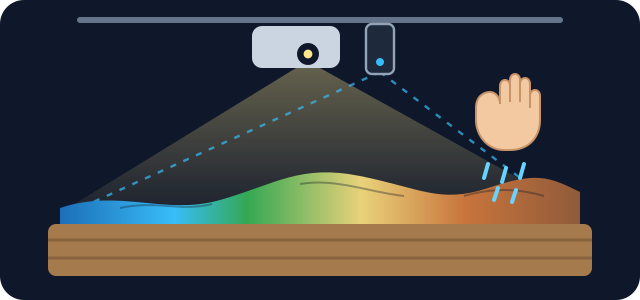</p>

| 部件 | 选什么 | 参考价格（美元） |
| --- | --- | --- |
| 深度相机 | 带 LiDAR 的 iPhone 或 iPad：iPhone 12 Pro 及之后的 Pro 机型，或 2020 款及更新的 iPad Pro | 手头有就是 0 元，二手约 200–300 |
| 投影仪 | 任意 HDMI 投影仪，720p 或更高。越亮越好；天花板低的话选短焦 | 约 120 |
| 电脑 | 任意装有 Chrome 或 Edge 的笔记本，和手机连同一个 Wi-Fi | 用你现有的 |
| 沙箱 | 约 100 × 75 cm、深 15–20 cm：床底收纳箱，或者在木板上钉四块板子 | 20–40 |
| 沙子 | 90–110 kg 细腻、浅色的游乐沙（铺 8–10 cm 厚）；浅色沙子显示投影效果最好 | 25–50 |
| 支架 | 手机夹配悬臂或三脚架；投影仪用搁板、三脚架或吊装支架 | 30–60 |

不算手机和电脑，总共大约 **200–300 美元**。

1. **安装硬件。** 投影仪和手机都放在沙面上方 1–1.5 米处，垂直朝下对准沙箱。投射距离、安装方式和沙子的选择见
   [硬件搭建指南](docs/hardware-setup-guide.md)（英文）。
2. **在笔记本上启动中继：** `npx livesand`（需要 Node 20 或更新版本），它会打印出下面要用的地址。
   如果 `npx` 暂时找不到这个包，可以从源码运行：`npm ci && npm run build && npm start`。
3. **打开投影模式。** 在连接投影仪的电脑上（通常就是这台笔记本）打开 `http://<笔记本IP>:8787/?mode=projector`，
   把窗口拖到投影仪屏幕上，按 **F** 全屏。
4. **安装 iPhone 应用。** LiveSand Depth 还没有上架 App Store，需要用 Xcode 和 XcodeGen 自行编译安装
   （免费 Apple ID 即可）。详细步骤见 [ios/README.md](ios/README.md)（英文）。
5. **配对。** 在应用里点 *Scan pairing QR code*，扫描投影页面 *Connect iPhone* 面板上的二维码，然后点 *Start streaming*。
6. **标定。** 深度数据一到，向导就会自动打开：点出沙箱四个角，采集平整沙面，设置起伏范围，把投影网格拖到沙箱上，保存。
   接下来就可以挖沙、堆山，把手悬在沙子上方造雨了。

还没有手机？运行 `npx livesand fake-source` 可以发送模拟的深度数据，先体验投影模式和标定向导。

## 操作方式

| 操作 | 鼠标 / 触控板 | 触屏 | 键盘 |
| --- | --- | --- | --- |
| 使用当前工具 | 左键拖动 | 单指拖动 | |
| 选择工具 | 底部工具栏 | 底部工具栏 | **1** Raise 抬升 · **2** Dig 挖掘 · **3** Smooth 平滑 · **4** Flatten 整平 · **5** Rain 降雨 · **6** Lava 岩浆 |
| 笔刷大小 | 滑块，Alt + 滚轮（2D 下直接滚轮） | 滑块 | **[** 和 **]** |
| 旋转视角（3D） | 右键拖动，或按住空格拖动 | 双指拖动 | |
| 缩放（3D） | 滚轮 | 双指捏合 | |
| 2D 地图 / 3D 视图 | 顶部工具栏 | 顶部工具栏 | **V** |
| 开始 / 重新开始关卡 | 开始按钮 | 开始按钮 | **Enter** / **R** |
| 选择关卡或真实地点 | 关卡菜单 | 关卡菜单 | |
| 模拟速度 1× / 2× / 4× | 顶部工具栏 | 顶部工具栏 | |
| 帮助 / 全屏 | 顶部工具栏 | 顶部工具栏 | **H** / **F** |

岩浆工具（**6**）只在自由模式、真实地点和火山关卡中出现。

投影模式：**H** 隐藏状态面板，**C** 重新标定，**F** 切换全屏，**Enter** 开始关卡，**R** 重新开始。

URL 参数让每种设置都能直接分享：

| 参数 | 取值 |
| --- | --- |
| `level` | `first-flood`、`twin-towns`、`flash-flood`、`mount-ember`、`hoi-an-floods`、`sandbox`（自由模式）、`blank`（空白平整沙箱） |
| `place` | 真实地点：`ha-long-bay`、`hoi-an`、`hue`、`fansipan`、`grand-canyon`、`mount-fuji`、`yosemite`、`mount-st-helens`，或者 `lat,lon[,widthKm]`（见[真实地点](#真实地点)） |
| `name` | `place` 坐标的名字，例如 `name=Da%20Nang` |
| `view` | `2d`、`3d` |
| `mode` | `projector`，用于真实沙盘 |
| `relay` | 投影模式使用的中继地址，例如 `192.168.1.20:8787` |
| `debug` | `1` 显示帧率和模拟步数 |

## 工作原理

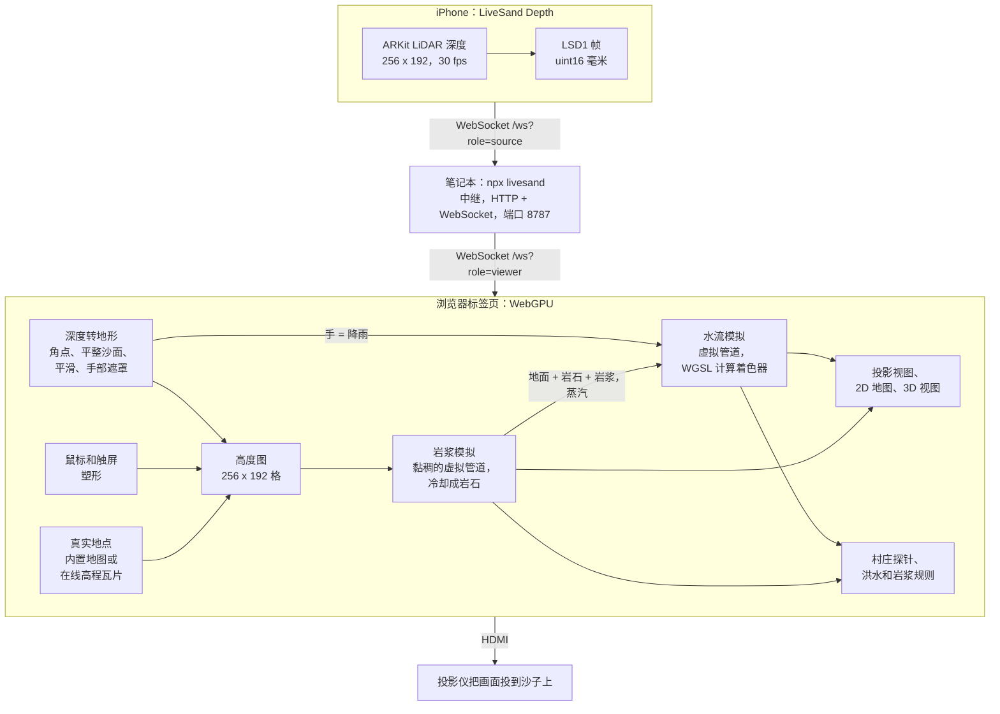

**水：虚拟管道模型。** 每个格子记录地形高度、水深，以及通往四个相邻格子的“虚拟管道”中的流量
（[Mei 等，2007](#致谢)）。每 50 毫秒的一步包含两次计算：第一次按重力乘以两侧水面高度差来加速每根管道里的水流
（带少量阻尼），并按比例缩小，保证一个格子流出的水不会多于它现有的水；第二次加上流入、减去流出，加入降雨和泉水，
再按每秒 1% 蒸发。开放的边界像海岸线一样把水排走。两个渲染器直接读取模拟所用的 GPU 缓冲区，
除了少量异步回读的村庄水深探针，没有任何数据需要拷回 CPU。

**岩浆：慢速管道。** 岩浆是第二套虚拟管道模拟，有自己的深度和流量。它的流动阻尼很大，而且必须克服一个随岩浆变薄而增大
的屈服应力，所以它会缓慢蠕动、堆成舌状，最后停下，而不是像水一样奔流。每一步都有少量岩浆凝固成岩石，碰到水或大海时
凝固得快得多；岩浆旁边的水会被煮干。水流模拟看到的地面是“地形 + 岩石 + 岩浆”，所以河水会绕开熔岩流，冷却后的熔岩就成了
新的陆地。村庄被熔岩覆盖几秒就会烧毁。

**真实地点：从高程到沙盘。** 内置地点由 `npm run bake:places` 预先烘焙成小文件（每个 96 KB，位于 `public/places/`）；
其他地点则在浏览器里下载周围的 [AWS Terrain Tiles](https://registry.opendata.aws/terrain-tiles/)，再重采样到网格上。
高度经过缩放，使陆地的起伏与自制关卡大致相当（会安、顺化这样平坦的三角洲固定放大 9 倍）。海平面以下变成绘制出来的海，
海岸与地图边缘相接的地方是开放边界；低于海平面的盆地，例如死亡谷和死海，仍然算作陆地。高程数据里的噪声会被平滑，
浅洼地会被填平让雨水流走，而且在第一帧之前会先把 15 秒的降雨导入河道，所以一打开地图，水系和湖泊就已经是满的。

**沙：从深度到地形。** 点出的四个角点确定了一个从 LiDAR 图像到模拟网格的单应变换。每个格子的高度等于平整沙面的参考深度
减去实测深度，并按比例缩放，使沙箱宽度正好对应 256 格。比标定时设置的最高堆沙高度再高出 5 cm 以上的东西会被当作手：
这些格子会下雨，同时保留上一次的沙面高度。逐格滑动平均、较小的变化阈值和轻度高斯模糊，让你挖沙时等高线依然稳定。
投影画面通过 CSS `matrix3d` 变换四角映射到沙箱上。

更多细节：[系统架构](docs/system-architecture.md) 和 [LSD1 深度协议](docs/depth-protocol.md)（英文）。

## 浏览器支持

LiveSand 需要 [WebGPU](https://caniuse.com/webgpu)。能否使用取决于浏览器、操作系统、GPU 和驱动，而且支持范围仍在扩大，
下表仅供参考：

| 浏览器 | 状态 |
| --- | --- |
| Chrome / Edge 113+ | Windows、macOS 和 ChromeOS，推荐使用。Android 需要较新设备上的 Chrome 121+ |
| Linux 上的 Chrome | 通常需要手动开启：`chrome://flags/#enable-unsafe-webgpu`（以及 Vulkan） |
| Safari 26 | macOS、iOS 和 iPadOS 26 |
| Firefox 141+ | Windows；其他平台正在陆续支持 |

如果浏览器不支持 WebGPU，LiveSand 会显示一个说明页，告诉你可以怎么做，而不是一片空白。

## 常见问题

**能用 Kinect 代替 iPhone 吗？**
暂时还不行。经典的 AR 沙盘用的是 Kinect，而 LiveSand 的深度输入只是一个很小的 WebSocket 协议
（[LSD1](docs/depth-protocol.md)：28 字节的头部加上 16 位毫米深度值），所以写一个 Kinect 桥接程序并不难。
它已在路线图上，也非常适合作为第一次贡献。

**Orbbec 或 Intel RealSense 呢？**
道理一样：任何深度相机，只要有桥接程序把 LSD1 帧发给中继就能用。这两款也都在路线图上。

**安卓手机可以吗？**
带真正深度传感器的安卓手机很少，而靠摄像头估算出来的深度太粗糙，分辨不出几厘米高的沙堆。
不过虚拟模式在安卓的 Chrome 上可以正常玩。

**我没有带 LiDAR 的手机，还能玩吗？**
能。虚拟模式只需要一个支持 WebGPU 的浏览器。想在没有手机的情况下体验投影模式和标定向导，运行 `npx livesand fake-source` 即可。

**既然是网页应用，为什么还要 `npx livesand`？**
通过 HTTPS 提供的页面（比如 GitHub Pages 上的演示）无法直接用明文 `ws://` 连接局域网里的手机。
中继在你的局域网内提供网页、转发深度数据流，并显示配对二维码。数据不会离开你的网络，而且只传输深度值，从不传输摄像头画面。

**需要联网吗？**
真实沙盘不需要：装好之后，中继、手机和浏览器只在本地网络内互相通信。关卡和八个内置地点都随应用一起发布；只有
**Your hometown…** 和其他 `?place=lat,lon` 地图需要联网，用来下载高程瓦片和搜索地名。

**我的位置会被发送出去吗？**
只有在你点 **Use my location** 时才会。浏览器会先征求你的同意；之后坐标会发给 Photon 用来给地图命名，也会以瓦片请求的
形式发给 AWS Terrain Tiles，并且会写进页面链接里。所以分享出去的链接能看出地图的中心在哪里；如果不想暴露确切位置，
请改用搜索城镇。

## 路线图

- [x] 岩浆和火山关卡（0.2）
- [x] 真实地点：内置地形、地球上任意城镇、“Flood it”暴风雨和可分享的地图链接（0.2）
- [ ] 侵蚀：让水流带走沙子（虚拟管道论文里就有这部分模型）
- [ ] 投影模式下在真沙子上玩岩浆
- [ ] 深度相机桥接：Orbbec、Intel RealSense、Kinect
- [ ] 教案：流域、等高线地图、防洪规划、火山
- [ ] LiveSand Depth 的 TestFlight / App Store 版本
- [ ] 更多关卡、更多真实地点挑战，以及关卡编辑器

欢迎提出想法和提交 PR，参见 [CONTRIBUTING.md](CONTRIBUTING.md) 和 [项目路线图](docs/project-roadmap.md)（英文）。

## 本地开发

```bash
git clone https://github.com/tranhuuhuy297/livesand && cd livesand
npm ci
npm run dev                       # http://localhost:5173（虚拟模式）
npm run typecheck && npm test     # TypeScript 类型检查 + 单元测试（Vitest）
npm run test:e2e                  # Playwright，无头 Chromium，WebGPU 跑在 SwiftShader 上
npm run build && npm start        # 在 8787 端口启动中继和构建好的网页，等同于 npx livesand
npm run demo:media                # 重新录制 docs/assets/ 里的 GIF 和截图（-- --only volcano,places）
npm run bake:places               # 从高程瓦片重新烘焙 public/places/ 里的内置真实地点
```

文档（英文）：[项目概览](docs/project-overview-pdr.md) · [代码库概要](docs/codebase-summary.md) ·
[代码规范](docs/code-standards.md) · [部署指南](docs/deployment-guide.md) · [更新日志](docs/project-changelog.md)

## 致谢

- 一切始于 Oliver Kreylos（加州大学戴维斯分校 KeckCAVES）的
  [UC Davis 增强现实沙盘](https://web.cs.ucdavis.edu/~okreylos/ResDev/SARndbox/)，它也是本项目的灵感来源。
- 水流模型参考了 Xing Mei、Philippe Decaudin 和 Bao-Gang Hu 的论文 *Fast Hydraulic Erosion Simulation and
  Visualization on GPU*（Pacific Graphics 2007）。
- 基于 [wgpu-matrix](https://github.com/greggman/wgpu-matrix)、[qrcode](https://github.com/soldair/node-qrcode) 和
  [ws](https://github.com/websockets/ws) 构建。
- 地点搜索由 komoot 的 [Photon](https://photon.komoot.io/) 提供，数据 ©
  [OpenStreetMap](https://www.openstreetmap.org/copyright) 贡献者。

### 地形数据

真实地点使用 Mapzen 通过 AWS 开放数据注册表提供的 [Terrain Tiles](https://registry.opendata.aws/terrain-tiles/)
（[署名要求](https://github.com/tilezen/joerd/blob/master/docs/attribution.md)，以下署名保留英文原文）。应用会在每张地图的
角落显示对应的数据来源。内置地点使用的数据：

- 下龙湾、会安、顺化、番西邦峰：global GMTED2010 and SRTM terrain data courtesy of the U.S. Geological Survey.
- 富士山：同上，另加：Global ETOPO1 terrain data U.S. National Oceanic and Atmospheric Administration.
- 科罗拉多大峡谷、优胜美地山谷、圣海伦火山：United States 3DEP (formerly NED) terrain data courtesy of the U.S.
  Geological Survey.

<details>
<summary>完整的地形数据署名（其他地点在线载入的地图可能用到其中任何来源）</summary>

- Terrain Tiles by Mapzen via the AWS Registry of Open Data.
- ArcticDEM terrain data DEM(s) were created from DigitalGlobe, Inc., imagery and funded under National Science Foundation awards 1043681, 1559691, and 1542736.
- Australia terrain data © Commonwealth of Australia (Geoscience Australia) 2017.
- Austria terrain data © offene Daten Österreichs – Digitales Geländemodell (DGM) Österreich.
- Canada terrain data contains information licensed under the Open Government Licence – Canada.
- Europe terrain data produced using Copernicus data and information funded by the European Union - EU-DEM layers.
- Global ETOPO1 terrain data U.S. National Oceanic and Atmospheric Administration.
- Mexico terrain data source: INEGI, Continental relief, 2016.
- New Zealand terrain data Copyright 2011 Crown copyright (c) Land Information New Zealand and the New Zealand Government (All rights reserved).
- Norway terrain data © Kartverket.
- United Kingdom terrain data © Environment Agency copyright and/or database right 2015. All rights reserved.
- United States 3DEP (formerly NED) and global GMTED2010 and SRTM terrain data courtesy of the U.S. Geological Survey.

</details>

## 许可证

[MIT](LICENSE) © LiveSand contributors。

如果 LiveSand 让你会心一笑，点个 Star 吧，能帮更多老师、博物馆和创客发现它。
