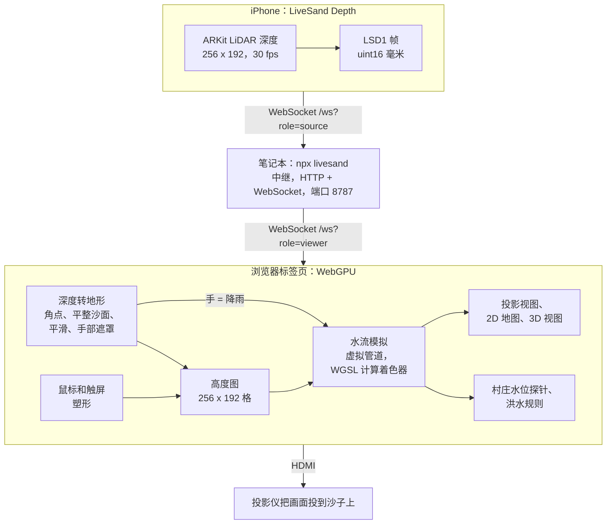

<p align="center">
  <a href="https://tranhuuhuy297.github.io/livesand/"></a>
</p>

<h1 align="center">LiveSand</h1>

<p align="center">
  <b>博物馆里一万美元的 AR 沙盘，用一台旧 iPhone、一台 120 美元的投影仪和一个浏览器标签页重新做出来。</b>
</p>

<p align="center">
  <a href="https://github.com/tranhuuhuy297/livesand/actions/workflows/ci.yml"></a>
  <a href="LICENSE"></a>
  <a href="#浏览器支持"></a>
  <a href="https://tranhuuhuy297.github.io/livesand/"></a>
</p>

<p align="center">
  <a href="https://tranhuuhuy297.github.io/livesand/"><b>在线试玩</b></a> ·
  <a href="#搭建真实沙盘">搭建真实沙盘</a> ·
  <a href="#工作原理">工作原理</a> ·
  <a href="README.md">English</a>
</p>

用鼠标挖一条河，实时模拟的水就会顺着它流走；堆起一道堤坝，洪水就会绕道而行。你也可以把真沙子放到投影仪下面：
iPhone 的激光雷达（LiDAR）每秒扫描沙面 30 次，投影仪再把等高线、河流和湖泊画回沙子上。把手悬在沙箱上方，那里就会下雨。

商用 AR 沙盘动辄一万美元左右（撰写本文时，TopoBox Educator DIY 套件标价 9,890 美元，另加 800 美元运费）。
LiveSand 免费、采用 MIT 许可证，在浏览器里就能运行。

## 10 秒上手

1. 用 Chrome、Edge 或 Safari 26 打开 **[tranhuuhuy297.github.io/livesand](https://tranhuuhuy297.github.io/livesand/)**。
2. Millbrook 村旁边的湖水正在上涨。按 **2**（Dig，挖掘），从村子一直拖到海边。
3. 坚持到倒计时结束，别让村子被淹。然后试试 Twin Towns（双子镇）和 Flash Flood（山洪暴发），或者进入自由模式（Free play）。

无需安装、无需注册、不用下载任何东西，水流模拟直接跑在你的 GPU 上。

| 2D 地图（Twin Towns） | 3D 视图（Flash Flood，暴风雨中） |
| :---: | :---: |
|  |  |
| **投影模式：投到沙子上的画面** | **标定：点出沙箱的四个角** |
|  |  |

## 功能特性

- **GPU 实时浅水模拟。** 基于“虚拟管道”模型，用 WebGPU 计算着色器在 256 × 192 的网格上求解：
  水往低处流，灌满湖泊，漫过堤坝，最后流入大海。
- **鼠标或触屏塑形。** 抬升、挖掘、平滑、整平和降雨五种工具，可在 2D 地形图和可环绕的 3D 视图之间切换。
- **拯救村庄。** 三个精心调校的关卡（上涨的湖水、分叉的河道、暴雨引发的山洪），带星级评价；
  还有自由模式，自带泉眼、可随机生成新地形，也能一键下雨。
- **真沙子，真的手。** 投影模式把 iPhone LiDAR 的深度数据变成地形，手悬在沙子上方，哪里就下雨。
- **五步标定。** 角点、平整沙面、起伏范围、投影梯形校正（CSS 四角映射）、保存。数据存在浏览器里，不需要任何配置文件。
- **硬件端只需一条命令。** `npx livesand` 同时提供网页、转发深度数据流，并显示供手机扫描的配对二维码。
- **小巧，依赖少。** 纯 WebGPU + WGSL，不用游戏引擎，也不用前端框架。每个关卡和视角都有可分享的链接。

## 搭建真实沙盘

<p align="center"></p>

| 部件 | 选什么 | 参考价格（美元） |
| --- | --- | --- |
| 深度相机 | 带 LiDAR 的 iPhone 或 iPad：iPhone 12 Pro 及之后的 Pro 机型，或 2020 款及更新的 iPad Pro | 手头有就是 0 元，二手约 200–300 |
| 投影仪 | 任意 HDMI 投影仪，720p 或更高。越亮越好；天花板低的话选短焦 | 约 120 |
| 电脑 | 任意装有 Chrome 或 Edge 的笔记本，和手机连同一个 Wi-Fi | 用你现有的 |
| 沙箱 | 约 100 × 75 cm、深 15–20 cm：床底收纳箱，或者在木板上钉四块板子 | 20–40 |
| 沙子 | 90–110 kg 细腻、浅色的游乐沙（铺 8–10 cm 厚）；浅色沙子显示投影效果最好 | 25–50 |
| 支架 | 手机夹配悬臂或三脚架；投影仪用搁板、三脚架或吊装支架 | 30–60 |

不算手机和电脑，总共大约 **200–300 美元**。

1. **安装硬件。** 投影仪和手机都放在沙面上方 1–1.5 米处，垂直朝下对准沙箱。投射距离、安装方式和沙子的选择见
   [硬件搭建指南](docs/hardware-setup-guide.md)（英文）。
2. **在笔记本上启动中继：** `npx livesand`（需要 Node 20 或更新版本），它会打印出下面要用的地址。
   如果 `npx` 暂时找不到这个包，可以从源码运行：`npm ci && npm run build && npm start`。
3. **打开投影模式。** 在连接投影仪的电脑上（通常就是这台笔记本）打开 `http://<笔记本IP>:8787/?mode=projector`，
   把窗口拖到投影仪屏幕上，按 **F** 全屏。
4. **安装 iPhone 应用。** LiveSand Depth 还没有上架 App Store，需要用 Xcode 和 XcodeGen 自行编译安装
   （免费 Apple ID 即可）。详细步骤见 [ios/README.md](ios/README.md)（英文）。
5. **配对。** 在应用里点 *Scan pairing QR code*，扫描投影页面 *Connect iPhone* 面板上的二维码，然后点 *Start streaming*。
6. **标定。** 深度数据一到，向导就会自动打开：点出沙箱四个角，采集平整沙面，设置起伏范围，把投影网格拖到沙箱上，保存。
   接下来就可以挖沙、堆山，把手悬在沙子上方造雨了。

还没有手机？运行 `npx livesand fake-source` 可以发送模拟的深度数据，先体验投影模式和标定向导。

## 操作方式

| 操作 | 鼠标 / 触控板 | 触屏 | 键盘 |
| --- | --- | --- | --- |
| 使用当前工具 | 左键拖动 | 单指拖动 | |
| 选择工具 | 底部工具栏 | 底部工具栏 | **1** Raise 抬升 · **2** Dig 挖掘 · **3** Smooth 平滑 · **4** Flatten 整平 · **5** Rain 降雨 |
| 笔刷大小 | 滑块，Alt + 滚轮（2D 下直接滚轮） | 滑块 | **[** 和 **]** |
| 旋转视角（3D） | 右键拖动，或按住空格拖动 | 双指拖动 | |
| 缩放（3D） | 滚轮 | 双指捏合 | |
| 2D 地图 / 3D 视图 | 顶部工具栏 | 顶部工具栏 | **V** |
| 开始 / 重新开始关卡 | 开始按钮 | 开始按钮 | **Enter** / **R** |
| 模拟速度 1× / 2× / 4× | 顶部工具栏 | 顶部工具栏 | |
| 帮助 / 全屏 | 顶部工具栏 | 顶部工具栏 | **H** / **F** |

投影模式：**H** 隐藏状态面板，**C** 重新标定，**F** 切换全屏，**Enter** 开始关卡，**R** 重新开始。

URL 参数让每种设置都能直接分享：

| 参数 | 取值 |
| --- | --- |
| `level` | `first-flood`、`twin-towns`、`flash-flood`、`sandbox`（自由模式）、`blank`（空白平整沙箱） |
| `view` | `2d`、`3d` |
| `mode` | `projector`，用于真实沙盘 |
| `relay` | 投影模式使用的中继地址，例如 `192.168.1.20:8787` |
| `debug` | `1` 显示帧率和模拟步数 |

## 工作原理



**水：虚拟管道模型。** 每个格子记录地形高度、水深，以及通往四个相邻格子的“虚拟管道”中的流量
（[Mei 等，2007](#致谢)）。每 50 毫秒的一步包含两次计算：第一次按重力乘以两侧水面高度差来加速每根管道里的水流
（带少量阻尼），并按比例缩小，保证一个格子流出的水不会多于它现有的水；第二次加上流入、减去流出，加入降雨和泉水，
再按每秒 1% 蒸发。开放的边界像海岸线一样把水排走。两个渲染器直接读取模拟所用的 GPU 缓冲区，
除了少量异步回读的村庄水深探针，没有任何数据需要拷回 CPU。

**沙：从深度到地形。** 点出的四个角点确定了一个从 LiDAR 图像到模拟网格的单应变换。每个格子的高度等于平整沙面的参考深度
减去实测深度，并按比例缩放，使沙箱宽度正好对应 256 格。比标定时设置的最高堆沙高度再高出 5 cm 以上的东西会被当作手：
这些格子会下雨，同时保留上一次的沙面高度。逐格滑动平均、较小的变化阈值和轻度高斯模糊，让你挖沙时等高线依然稳定。
投影画面通过 CSS `matrix3d` 变换四角映射到沙箱上。

更多细节：[系统架构](docs/system-architecture.md) 和 [LSD1 深度协议](docs/depth-protocol.md)（英文）。

## 浏览器支持

LiveSand 需要 [WebGPU](https://caniuse.com/webgpu)。能否使用取决于浏览器、操作系统、GPU 和驱动，而且支持范围仍在扩大，
下表仅供参考：

| 浏览器 | 状态 |
| --- | --- |
| Chrome / Edge 113+ | Windows、macOS 和 ChromeOS，推荐使用。Android 需要较新设备上的 Chrome 121+ |
| Linux 上的 Chrome | 通常需要手动开启：`chrome://flags/#enable-unsafe-webgpu`（以及 Vulkan） |
| Safari 26 | macOS、iOS 和 iPadOS 26 |
| Firefox 141+ | Windows；其他平台正在陆续支持 |

如果浏览器不支持 WebGPU，LiveSand 会显示一个说明页，告诉你可以怎么做，而不是一片空白。

## 常见问题

**能用 Kinect 代替 iPhone 吗？**
暂时还不行。经典的 AR 沙盘用的是 Kinect，而 LiveSand 的深度输入只是一个很小的 WebSocket 协议
（[LSD1](docs/depth-protocol.md)：28 字节的头部加上 16 位毫米深度值），所以写一个 Kinect 桥接程序并不难。
它已在路线图上，也非常适合作为第一次贡献。

**Orbbec 或 Intel RealSense 呢？**
道理一样：任何深度相机，只要有桥接程序把 LSD1 帧发给中继就能用。这两款也都在路线图上。

**安卓手机可以吗？**
带真正深度传感器的安卓手机很少，而靠摄像头估算出来的深度太粗糙，分辨不出几厘米高的沙堆。
不过虚拟模式在安卓的 Chrome 上可以正常玩。

**我没有带 LiDAR 的手机，还能玩吗？**
能。虚拟模式只需要一个支持 WebGPU 的浏览器。想在没有手机的情况下体验投影模式和标定向导，运行 `npx livesand fake-source` 即可。

**既然是网页应用，为什么还要 `npx livesand`？**
通过 HTTPS 提供的页面（比如 GitHub Pages 上的演示）无法直接用明文 `ws://` 连接局域网里的手机。
中继在你的局域网内提供网页、转发深度数据流，并显示配对二维码。数据不会离开你的网络，而且只传输深度值，从不传输摄像头画面。

**需要联网吗？**
不需要。装好之后，中继、手机和浏览器只在本地网络内互相通信。

## 路线图

- [ ] 侵蚀：让水流带走沙子（虚拟管道论文里就有这部分模型）
- [ ] 岩浆模式和其他流体
- [ ] 深度相机桥接：Orbbec、Intel RealSense、Kinect
- [ ] 教案：流域、等高线地图、防洪规划
- [ ] LiveSand Depth 的 TestFlight / App Store 版本
- [ ] 更多关卡和关卡编辑器

欢迎提出想法和提交 PR，参见 [CONTRIBUTING.md](CONTRIBUTING.md) 和 [项目路线图](docs/project-roadmap.md)（英文）。

## 本地开发

```bash
git clone https://github.com/tranhuuhuy297/livesand && cd livesand
npm ci
npm run dev                       # http://localhost:5173（虚拟模式）
npm run typecheck && npm test     # TypeScript 类型检查 + 单元测试（Vitest）
npm run test:e2e                  # Playwright，无头 Chromium，WebGPU 跑在 SwiftShader 上
npm run build && npm start        # 在 8787 端口启动中继和构建好的网页，等同于 npx livesand
npm run demo:media                # 重新录制 docs/assets/ 里的 GIF 和截图
```

文档（英文）：[项目概览](docs/project-overview-pdr.md) · [代码库概要](docs/codebase-summary.md) ·
[代码规范](docs/code-standards.md) · [部署指南](docs/deployment-guide.md) · [更新日志](docs/project-changelog.md)

## 致谢

- 一切始于 Oliver Kreylos（加州大学戴维斯分校 KeckCAVES）的
  [UC Davis 增强现实沙盘](https://web.cs.ucdavis.edu/~okreylos/ResDev/SARndbox/)，它也是本项目的灵感来源。
- 水流模型参考了 Xing Mei、Philippe Decaudin 和 Bao-Gang Hu 的论文 *Fast Hydraulic Erosion Simulation and
  Visualization on GPU*（Pacific Graphics 2007）。
- 基于 [wgpu-matrix](https://github.com/greggman/wgpu-matrix)、[qrcode](https://github.com/soldair/node-qrcode) 和
  [ws](https://github.com/websockets/ws) 构建。

## 许可证

[MIT](LICENSE) © LiveSand contributors。

如果 LiveSand 让你会心一笑，点个 Star 吧，能帮更多老师、博物馆和创客发现它。
