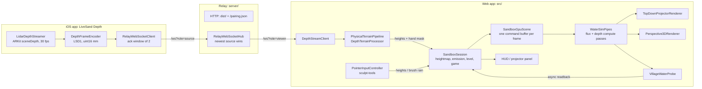

# System architecture

LiveSand has three programs: the **web app** (TypeScript + WebGPU, `src/`), the **relay** (Node, `server/`, shipped as
`npx livesand`) and the **iOS depth streamer** (SwiftUI + ARKit, `ios/`). Virtual mode needs only the web app.

## Units and coordinates

- 1 world unit = 1 grid cell. Heights and water depths use the same unit, so the shallow-water physics is consistent.
- Default grid 256 × 192 (`DEFAULT_GRID`), row-major, `index = y * width + x`, north = row 0.
- The 3D view maps grid `(x, y, h)` to world `(x − w/2, h × verticalScale, y − h/2)` with y up (`gridToWorld`).
- Levels place features in normalised `(u, v)` in 0..1 so layouts do not depend on grid size.

## Web app

### Boot

`src/main.ts` installs `window.__livesand`, parses URL parameters (`app-url-params.ts`) and creates the WebGPU device
(`gpu-context.ts`). Without WebGPU it shows a help page (`fatal-error-screen.ts`). `?mode=projector` loads
`projector-mode-app.ts` as a separate chunk (QR code and depth pipeline are only needed next to a real sandbox);
otherwise `virtual-mode-app.ts` starts.

### Frame loop

`FrameLoop` drives `requestAnimationFrame` with the real frame time clamped to 0.1 s. Each frame:

1. Input is applied to the CPU heightmap (`PointerInputController.applyFrame`, or the depth pipeline in projector mode).
2. `SandboxSession.frame` uploads the heightmap if it changed, accumulates simulated time and runs whole 50 ms steps,
   at most 8 per frame times the speed-up (1×, 2×, 4×). A slow frame drops simulated time instead of spiralling.
3. The emission field (springs + storm rain + brush rain + hand rain) is re-uploaded only when it changed.
4. `SandboxGpuScene.submitFrame` encodes the sim steps, the village probes and the active view into **one** command
   buffer, submits it, then requests the probe readback.
5. The game clock advances by the simulated time and reads the latest probe values (one frame behind at most).

Levels pre-run their springs on load (`prefillSec`) so the first frame already shows flowing rivers; the water then
stays frozen under the briefing card until the player starts.

### Water simulation (`src/gpu/`)

`WaterSimPipes` owns four storage buffers shared with the renderers and probes: `terrain` and `water` (f32 per cell),
`flux` (vec4 per cell: outflow left, right, north, south) and `emission` (f32 units/s per cell). Each step is two
compute dispatches (8 × 8 workgroups) in one compute pass:

- **Flux** (`fluxMain`): for each neighbour, `f = max(0, damping · f + dt · g · Δh)` where `Δh` is the difference in
  water-surface height (terrain + water). Open edges see an empty neighbour at the cell's own terrain height. The four
  outflows are scaled by `min(1, d / (Σf · dt))` so depth never goes negative.
- **Depth** (`depthMain`): `d += dt · (inflow − outflow + emission)`, then evaporation `d *= 1 − e · dt`.

Defaults (`water-sim-params-validation.ts`): `g = 9.81`, `damping = 0.995`, `evaporation = 0.01/s`, `dt = 0.05 s`,
all edges walls. Levels open the edge where the sea is.

### Rendering (`src/render/`)

Both renderers read the sim buffers directly through a shared per-frame uniform block (`render-frame-uniforms.ts`) and
a WGSL library (elevation colormap, anti-aliased contour lines, hillshade, flow-advected ripples, foam, rain rings).

- **`TopDownProjectorRenderer`**: one full-screen triangle. Used for the 2D map (quarter-turned on portrait screens) and
  for projector mode, where the canvas is corner-pinned onto the sandbox with a CSS `matrix3d` (`keystone-surface.ts`).
- **`Perspective3DRenderer`**: sky and backdrop, the heightfield mesh with box-wall skirts, instanced village houses and
  an alpha-blended water surface with glass walls; 4× MSAA. `OrbitCamera` is pure math (unit-tested in Node).
- The painted sea in virtual mode is display-only (`seaLevel` uniform); physically, water leaves through the open edge.

### Game (`src/game/`)

- `level-definitions.ts`: three levels plus free play and a blank box. Terrains are deterministic from a seed
  (`terrain-generators.ts`, `terrain-layouts.ts`, `seeded-value-noise.ts`).
- `VillageFloodGame`: a village floods while its probe depth exceeds the threshold (0.5 units) and is lost after
  15–20 s of flooding; flooded time slowly recovers once it is dry again. The level is won if any village survives
  the clock, lost if none does; stars count the villages kept (3 = all).
- `VillageWaterProbe` (`src/gpu/`): one workgroup per village reduces the maximum water depth inside its circle; the
  result is read back asynchronously so the frame loop never waits on the GPU.
- `village-sculpt-floor.ts`: village ground can be raised but not dug below its loaded height.

### Input (`src/input/`, `src/app/`)

`view-screen-mapping.ts` converts client pixels to grid cells (2D: direct; 3D: `heightfield-ray-picker.ts`).
`sculpt-tools.ts` applies Raise / Dig / Smooth / Flatten along the drag path, so a fast swipe digs the same channel as
a slow one. Touch waits 100 ms or 8 px before sculpting so a second finger can turn it into an orbit/pinch gesture.

### Projector mode (`src/app/physical/`)

- `DepthStreamClient` connects to the relay as a viewer, decodes LSD1, keeps only the newest frame, reconnects with
  backoff and treats 15 s of silence as a dead link.
- `PhysicalTerrainPipeline` runs `DepthTerrainProcessor` (`src/core/`) on the newest frame:
  1. homography from the four sandbox corners to the grid, invalid-aware bilinear resampling;
  2. height = (flat-sand reference − depth) × units per metre, clamped to the dig/pile range;
  3. pixels more than 5 cm above the pile limit form the hand mask (dilated), which drives hand rain; those cells keep
     their last height;
  4. per-cell EMA (0.3) with a 0.75-unit hysteresis, then a masked Gaussian blur (σ = 1.5 cells).
- `PhysicalCalibrationSession` chooses the calibration in use (saved, a rough automatic fallback, or the live wizard
  draft) and runs the five-step `CalibrationWizard`. `calibration-storage.ts` persists it, versioned and validated, in
  `localStorage`.
- `PairingPanel` fetches `/pairing.json` and shows the source URL as a QR code when no depth source is live.

### Debug API

`window.__livesand` exposes `ready`, `error` and `debug.{readWater, getHeights, stepFrames, state}`. `stepFrames` pauses
the rAF loop and runs fixed-dt frames, which makes the e2e tests and `scripts/record-demo-media.mjs` deterministic.
Projector mode also exposes `window.__livesandPhysical` (the running controller).

## Relay (`server/`)

- `cli.ts`: `livesand [--port 8787] [--host <addr>] [--allow-origin <origin>...]` and
  `livesand fake-source [--url] [--fps] [--width] [--height]`. Friendly messages and exit code 2 for usage errors.
- `relay-server.ts`: HTTP server for `dist/` (`static-file-handler.ts`, path-traversal safe), `/pairing.json` and
  WebSocket upgrades on `/ws`.
- `relay-websocket-hub.ts`: separate WebSocket servers for sources (4 MiB + 28 byte messages) and viewers (4 KiB).
  The newest source wins (the old one is closed with 4001); only valid LSD1 frames are forwarded; every message is
  acknowledged; viewers get a status message every 5 s; dead peers are reaped by ping.
- `relay-origin-policy.ts`: native clients (no Origin), loopback pages, the relay's own LAN origin, `--allow-origin`
  entries and (viewers only) `*.github.io` are allowed; anything else gets 403. This blocks other web pages and DNS
  rebinding from injecting or reading depth.
- `relay-peer-limits.ts`: 4 sources, 16 viewers, 8 sockets per address.
- `lan-addresses.ts`: ranks LAN addresses for the banner and pairing QR (physical interfaces and the default route
  first; Docker, VPN and virtual adapters dropped).

Wire format and messages: [depth-protocol.md](depth-protocol.md).

## iOS app (`ios/LiveSandDepth/`)

SwiftUI app generated with XcodeGen (`project.yml`). `LidarDepthStreamer` runs ARKit scene depth on a serial queue and
throttles to 30 fps; `DepthFrameEncoder` converts float metres to uint16 millimetres and zeroes low-confidence pixels;
`RelayWebSocketClient` sends frames with at most two unacknowledged (`FrameSendWindow`), reconnects with backoff
(`RelayLinkPolicy`) and stops on 4001. `RelayURLParser` accepts pairing QR codes, typed IPs and `?relay=` links but
rejects public web URLs. Details: [ios/README.md](../ios/README.md).

## Tests

- **Unit** (`tests/unit/`, Vitest, Node): depth protocol and processor, homography, calibration storage, relay
  (HTTP, security, sources, LAN ranking), sculpt tools, terrain generators, levels (a CPU reference simulation plays
  every level), orbit camera, render/session helpers.
- **E2E** (`tests/e2e/`, Playwright): headless Chromium with WebGPU on SwiftShader. GPU harness pages in
  `tests/gpu-harness/` test the water sim and renderers in isolation; app specs drive virtual and projector mode
  through the debug API, with a real relay and fake depth source for physical mode.
