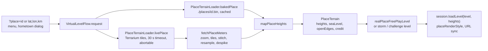

# System architecture

LiveSand has three programs: the **web app** (TypeScript + WebGPU, `src/`), the **relay** (Node, `server/`, shipped as
`npx livesand`) and the **iOS depth streamer** (SwiftUI + ARKit, `ios/`). Virtual mode needs only the web app.

```mermaid
flowchart LR
  subgraph ios["iOS app: LiveSand Depth"]
    ar["LidarDepthStreamer<br/>ARKit sceneDepth, 30 fps"] --> enc["DepthFrameEncoder<br/>LSD1, uint16 mm"]
    enc --> ws["RelayWebSocketClient<br/>ack window of 2"]
  end
  subgraph relay["Relay: server/"]
    http["HTTP: dist/ + /pairing.json"]
    hub["RelayWebSocketHub<br/>newest source wins"]
  end
  subgraph web["Web app: src/"]
    client["DepthStreamClient"] --> pipe["PhysicalTerrainPipeline<br/>DepthTerrainProcessor"]
    pointer["PointerInputController<br/>sculpt-tools"]
    flow["VirtualLevelFlow<br/>levels, real-map requests"]
    loader["PlaceTerrainLoader<br/>baked maps, live tiles"]
    session["SandboxSession<br/>heightmap, emission, lava field, level, game"]
    scene["SandboxGpuScene<br/>one command buffer per frame"]
    lava["LavaSim<br/>flux, depth, cool, steam, compose"]
    sim["WaterSimPipes<br/>flux + depth compute passes"]
    top["TopDownProjectorRenderer"]
    persp["Perspective3DRenderer"]
    probe["VillageWaterProbe<br/>water + lava probes"]
    hud["HUD / projector panel"]
  end
  tiles["AWS Terrain Tiles<br/>+ Photon geocoder"]
  ws -- "/ws?role=source" --> hub
  hub -- "/ws?role=viewer" --> client
  pipe -- "heights + hand mask" --> session
  pointer -- "heights / brush rain / brush lava" --> session
  tiles -. live places only .-> loader
  loader -- "PlaceTerrain" --> flow
  flow -- "level + heights" --> session
  session --> scene
  scene --> lava
  lava -- "ground = base + rock + lava" --> sim
  scene --> sim
  sim --> top
  sim --> persp
  lava --> top
  lava --> persp
  sim --> probe
  lava --> probe
  probe -- "async readback" --> session
  session --> hud
```

## Units and coordinates

- 1 world unit = 1 grid cell. Heights and water depths use the same unit, so the shallow-water physics is consistent.
- Default grid 256 × 192 (`DEFAULT_GRID`), row-major, `index = y * width + x`, north = row 0.
- The 3D view maps grid `(x, y, h)` to world `(x − w/2, h × verticalScale, y − h/2)` with y up (`gridToWorld`).
- Levels place features in normalised `(u, v)` in 0..1 so layouts do not depend on grid size.
- Real places keep 1 cell = `widthKm / (width − 1)` horizontally; vertically, `metersPerUnitVertical` comes from the
  vertical exaggeration (see [Real places](#real-places-srcgame-srcapp)). Land starts 2 units above the sculpt floor,
  and on coasts 0 m maps to that same 2 units (the painted sea level).

## Web app

### Boot

`src/main.ts` installs `window.__livesand`, parses URL parameters (`app-url-params.ts`: `mode`, `level`, `place`,
`name`, `view`, `relay`, `debug`) and creates the WebGPU device (`gpu-context.ts`). Without WebGPU it shows a help page
(`fatal-error-screen.ts`). `?mode=projector` loads `projector-mode-app.ts` as a separate chunk (QR code and depth
pipeline are only needed next to a real sandbox); otherwise `virtual-mode-app.ts` starts.

### Frame loop

`FrameLoop` drives `requestAnimationFrame` with the real frame time clamped to 0.1 s. Each frame:

1. Input is applied to the CPU heightmap (`PointerInputController.applyFrame`, or the depth pipeline in projector mode).
2. `SandboxSession.frame` uploads the heightmap if it changed, accumulates simulated time and runs whole 50 ms steps,
   at most 8 per frame times the speed-up (1×, 2×, 4×). A slow frame drops simulated time instead of spiralling.
3. The emission field (springs + storm rain + brush rain + hand rain) and the lava emission (crater + lava brush) are
   re-uploaded only when they changed.
4. `SandboxGpuScene.submitFrame` encodes the lava steps (only while lava is poured or still moving), the water steps,
   the village water and lava probes and the active view into **one** command buffer, submits it, then requests the
   probe readbacks.
5. The game clock advances by the simulated time and reads the latest probe values (one frame behind at most).

Levels pre-run their springs on load (`prefillSec`, plus routed rain on real maps, `prefillRain`) so the first frame
already shows flowing rivers; the water then stays frozen under the briefing card until the player starts.

### Water simulation (`src/gpu/`)

`WaterSimPipes` owns four storage buffers shared with the renderers and probes: `terrain` and `water` (f32 per cell),
`flux` (vec4 per cell: outflow left, right, north, south) and `emission` (f32 units/s per cell). Each step is two
compute dispatches (8 × 8 workgroups) in one compute pass:

- **Flux** (`fluxMain`): for each neighbour, `f = max(0, damping · f + dt · g · Δh)` where `Δh` is the difference in
  water-surface height (terrain + water). Open edges see an empty neighbour at the cell's own terrain height. The four
  outflows are scaled by `min(1, d / (Σf · dt))` so depth never goes negative.
- **Depth** (`depthMain`): `d += dt · (inflow − outflow + emission)`, then evaporation `d *= 1 − e · dt`.

Defaults (`water-sim-params-validation.ts`): `g = 9.81`, `damping = 0.995`, `evaporation = 0.01/s`, `dt = 0.05 s`,
all edges walls. Levels open the edge where the sea is.

### Lava simulation (`src/gpu/lava-sim*.ts`)

`LavaSim` runs on top of the water sim and only exists in virtual mode (`SandboxGpuScene` is built with
`{ lava: true }`; projector mode never pays for it). It owns five storage buffers: `baseTerrain` (the CPU-sculpted
ground), `rock`, `lava` (f32 per cell), `lavaFlux` (vec4 per cell) and `lavaEmission` (units/s per cell), and writes
the water sim's `terrain` buffer. Each step is four dispatches in one compute pass, and every encode ends with a
compose pass:

- **Flux** (`fluxMain`): virtual pipes over the lava head `base + rock + lava`, with Bingham-style friction: a pipe only
  accelerates when the head drop beats `yieldHead = 0.1 / depth`, so thin lava stalls and flows end in lobes. Open
  edges let lava leave the box; outflow is scaled so depth never goes negative.
- **Depth** (`depthMain`): `lava += dt · (inflow − outflow + emission)`.
- **Cool** (`coolMain`): a fraction `cooling · dt` of the depth turns into rock, plus `quench` where the cell or a
  neighbour is wet: water deeper than 0.05 or ground below the painted `seaLevel` (so lava entering the sea on a real
  coast or Mount Ember freezes into new land). Films thinner than 0.005 freeze outright.
- **Steam** (`steamMain`): water next to lava loses `steam · dt · lavaDepth` per step.
- **Compose** (`composeMain`): `terrain = base + rock + lava`, so water flows around a lava flow and over cooled rock.

Rheology: `damping` 0.975 and `coolingPerSec` 0.015 in the sandbox (`SANDBOX_LAVA_FLOW`); levels override them
(`lavaFlow`, Mount Ember uses damping 0.985). `quenchPerSec` 1, `steamPerSec` 2, `dt` 0.05 s like the water.

Around it:

- `SessionLavaField` builds the emission (the level's `eruption` crater following its keyframes on the level clock,
  plus the Lava brush) and tracks whether lava may still move; frames without lava skip the lava steps entirely.
- `SceneLavaLayer` adds lava probes (reusing `VillageWaterProbe` on the lava buffer): the deepest lava over each
  village, within 2.5 village radii (+4 cells, the **Lava close** warning) and anywhere on the grid.
- `VillageFloodGame` burns a village after `burnSecondsToLose` (3 s) with more than 0.1 units of molten lava over it;
  like flooding, burned time recovers at half speed once the lava is gone.
- `ashLevelOf` feeds the eruption strength to the 3D sky, fog and light.
- `readLava` / `readRock` on the debug API, and a CPU replica in `tests/unit/level-lava-reference-sim.ts` that proves
  Mount Ember is lost idle and won with a wall or a trench.

### Real places (`src/game/`, `src/app/`)

- **Sources.** Baked maps (`public/places/<id>.bin`, the LSP1 format in `real-place-baked-format.ts`: a 24-byte
  header and uint16-quantised metres, 256 × 192) are fetched once per session and cached. Any other place fetches the
  AWS Terrain Tiles (Terrarium PNGs, CORS-enabled) at the zoom whose pixels are just finer than a grid cell, decodes
  them with `createImageBitmap` + `OffscreenCanvas` (colour conversion off), stitches a Web Mercator mosaic and samples
  it bilinearly, then removes SRTM void spikes. `scripts/bake-real-places.mjs` runs the same code in Node (pngjs) to
  bake the catalogue and writes the tile sources into each file for the credit.
- **Height mapping** (`mapPlaceHeights`):
  1. Sea detection (`real-place-sea-detection.ts`) separates real sea (a 0 m plateau or smooth bathymetry touching
     the border) from basins below sea level, which stay land.
  2. Vertical exaggeration: `metersPerCell · 30 / landRelief`, clamped to 0.5–25, unless the place sets one (Hội An
     and Huế use 9).
  3. Coasts: sea specks inland are filled, the sea floor goes at least 0.5 units under the sea level (crisp coasts),
     and every edge whose cells are at least 5 % ocean opens. Inland maps open every edge so rivers leave the
     frame.
  4. Land blur passes when DEM noise (about 3 m) would exceed 0.3 units, then shallow closed hollows up to 1 unit deep
     are filled by a priority flood from the border and the sea (deep ones such as crater lakes stay).
- **Water at load.** Real-place free play prefills 15 s of rain (0.004 units/s) routed along D8 flow
  (`terrain-flow-routing.ts`) straight into channels that drain at least 0.2 % of the map, so rivers and lakes are
  full on the first frame without a film of water on every slope.
- **Levels.** `realPlaceFreePlayLevel` (no villages, no clock, Lava tool, rain toggle), `realPlaceStormLevel`
  ("Flood it": a 60 s storm, the town placed by `stormTownSpot` on low, flat, dry ground near the centre and off the
  river channels, no prefill) and challenge levels that name a place (`HOI_AN_FLOODS_LEVEL.place = { id: 'hoi-an' }`).
  The flow keeps the open real-place free play so the storm and "back to the map" reuse its terrain without
  downloading again.
- **Requests.** Every request gets a token; a newer choice aborts the older download and its answer is dropped. A
  real map in the startup URL downloads after the first frame (a blank box stands in); only if that download fails
  does the first level open. Failures show a toast and keep the current level.
- **Display.** `placeRenderStyle` sets the painted sea level and height range from the terrain; the sculpt ceiling
  rises to the map's highest point + 4. Real maps stay north-up on portrait phones (made-up levels turn a quarter
  and show a north arrow). The HUD shows a loading pill and the terrain credit for the contributing sources.
- **Place names.** `place-name-geocoder.ts` calls Photon (`/api` to search, `/reverse` for "Use my location") with an
  8 s timeout; a searched place's extent suggests the map width. The hometown dialog drops answers that arrive after
  it closed or a newer choice was made. Links carry `?place=lat,lon,km` (5 decimals) and `&name=` (sanitised, 60
  characters at most).

### Rendering (`src/render/`)

Both renderers read the sim buffers directly through a shared per-frame uniform block (`render-frame-uniforms.ts`) and
a WGSL library (elevation colormap, anti-aliased contour lines, hillshade, flow-advected ripples, foam, rain rings).

- **`TopDownProjectorRenderer`**: one full-screen triangle. Used for the 2D map (quarter-turned on portrait screens) and
  for projector mode, where the canvas is corner-pinned onto the sandbox with a CSS `matrix3d` (`keystone-surface.ts`).
- **`Perspective3DRenderer`**: sky and backdrop, the heightfield mesh with box-wall skirts, instanced village houses and
  an alpha-blended water surface with glass walls; 4× MSAA. `OrbitCamera` is pure math (unit-tested in Node).
- The painted sea in virtual mode is display-only for water (`seaLevel` uniform; water leaves through the open edge),
  but the lava sim treats ground below it as wet.
- Lava shading shares the frame bind group: bindings 5 (lava), 6 (rock) and 8 (lava emission, fragment only) read the
  lava sim's buffers, and binding 7 is a per-frame effects field (glow, steam, flow slope) written by one compute pass.
  Without lava every slot binds a tiny zero buffer and the lava code paths are skipped. The fragment stage now uses 8
  storage buffers, the WebGPU guaranteed minimum limit, so new per-cell fields need packing into existing buffers.

### Game (`src/game/`)

- `level-definitions.ts`: five levels (First Flood, Twin Towns, Flash Flood, Mount Ember, Hội An Floods) plus free
  play, a blank box and the real-place levels. Terrains are deterministic from a seed
  (`terrain-generators.ts`, `terrain-layouts.ts`, `seeded-value-noise.ts`).
- `VillageFloodGame`: a village floods while its probe depth exceeds the threshold (0.5 units) and is lost after
  10–20 s of flooding; it burns while molten lava over it is deeper than 0.1 units and is lost after 3 s; flooded and
  burned time slowly recover once it is dry or the lava is gone. The level is won if any village survives
  the clock, lost if none does; stars count the villages kept (3 = all).
- `VillageWaterProbe` (`src/gpu/`): one workgroup per village reduces the maximum water depth inside its circle; the
  result is read back asynchronously so the frame loop never waits on the GPU.
- `village-sculpt-floor.ts`: village ground can be raised but not dug below its loaded height.

### Input (`src/input/`, `src/app/`)

`view-screen-mapping.ts` converts client pixels to grid cells (2D: direct; 3D: `heightfield-ray-picker.ts`).
`sculpt-tools.ts` applies Raise / Dig / Smooth / Flatten along the drag path, so a fast swipe digs the same channel as
a slow one. Touch waits 100 ms or 8 px before sculpting so a second finger can turn it into an orbit/pinch gesture.

### Projector mode (`src/app/physical/`)

- `DepthStreamClient` connects to the relay as a viewer, decodes LSD1, keeps only the newest frame, reconnects with
  backoff and treats 15 s of silence as a dead link.
- `PhysicalTerrainPipeline` runs `DepthTerrainProcessor` (`src/core/`) on the newest frame:
  1. homography from the four sandbox corners to the grid, invalid-aware bilinear resampling;
  2. height = (flat-sand reference − depth) × units per metre, clamped to the dig/pile range;
  3. pixels more than 5 cm above the pile limit form the hand mask (dilated), which drives hand rain; those cells keep
     their last height;
  4. per-cell EMA (0.3) with a 0.75-unit hysteresis, then a masked Gaussian blur (σ = 1.5 cells).
- `PhysicalCalibrationSession` chooses the calibration in use (saved, a rough automatic fallback, or the live wizard
  draft) and runs the five-step `CalibrationWizard`. `calibration-storage.ts` persists it, versioned and validated, in
  `localStorage`.
- `PairingPanel` fetches `/pairing.json` and shows the source URL as a QR code when no depth source is live.

### Debug API

`window.__livesand` exposes `ready`, `error` and `debug.{readWater, getHeights, stepFrames, state}`. `stepFrames` pauses
the rAF loop and runs fixed-dt frames, which makes the e2e tests and `scripts/record-demo-media.mjs` deterministic.
Projector mode also exposes `window.__livesandPhysical` (the running controller).

## Relay (`server/`)

- `cli.ts`: `livesand [--port 8787] [--host <addr>] [--allow-origin <origin>...]` and
  `livesand fake-source [--url] [--fps] [--width] [--height]`. Friendly messages and exit code 2 for usage errors.
- `relay-server.ts`: HTTP server for `dist/` (`static-file-handler.ts`, path-traversal safe), `/pairing.json` and
  WebSocket upgrades on `/ws`.
- `relay-websocket-hub.ts`: separate WebSocket servers for sources (4 MiB + 28 byte messages) and viewers (4 KiB).
  The newest source wins (the old one is closed with 4001); only valid LSD1 frames are forwarded; every message is
  acknowledged; viewers get a status message every 5 s; dead peers are reaped by ping.
- `relay-origin-policy.ts`: native clients (no Origin), loopback pages, the relay's own LAN origin, `--allow-origin`
  entries and (viewers only) `*.github.io` are allowed; anything else gets 403. This blocks other web pages and DNS
  rebinding from injecting or reading depth.
- `relay-peer-limits.ts`: 4 sources, 16 viewers, 8 sockets per address.
- `lan-addresses.ts`: ranks LAN addresses for the banner and pairing QR (physical interfaces and the default route
  first; Docker, VPN and virtual adapters dropped).

Wire format and messages: [depth-protocol.md](depth-protocol.md).

## iOS app (`ios/LiveSandDepth/`)

SwiftUI app generated with XcodeGen (`project.yml`). `LidarDepthStreamer` runs ARKit scene depth on a serial queue and
throttles to 30 fps; `DepthFrameEncoder` converts float metres to uint16 millimetres and zeroes low-confidence pixels;
`RelayWebSocketClient` sends frames with at most two unacknowledged (`FrameSendWindow`), reconnects with backoff
(`RelayLinkPolicy`) and stops on 4001. `RelayURLParser` accepts pairing QR codes, typed IPs and `?relay=` links but
rejects public web URLs. Details: [ios/README.md](../ios/README.md).

## Tests

- **Unit** (`tests/unit/`, Vitest, Node): depth protocol and processor, homography, calibration storage, relay
  (HTTP, security, sources, LAN ranking), sculpt tools, terrain generators, levels (CPU reference simulations of the
  water and the lava play every level), real places (Terrarium decoding, resampling, baked format, live loading with
  aborts, height mapping, sea vs basins, hollows, river prefill, storm town), level flow (startup race, cancel), place
  search and sharing, orbit camera, render/session helpers.
- **E2E** (`tests/e2e/`, Playwright): headless Chromium with WebGPU on SwiftShader. GPU harness pages in
  `tests/gpu-harness/` test the water sim, the lava sim and the renderers in isolation; app specs drive virtual and
  projector mode through the debug API, with a real relay and fake depth source for physical mode. Real-place specs
  load the baked maps; the hometown spec mocks the tiles, the geocoder and geolocation, so e2e runs need no network.
